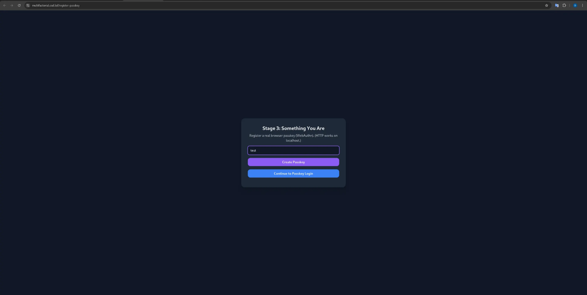
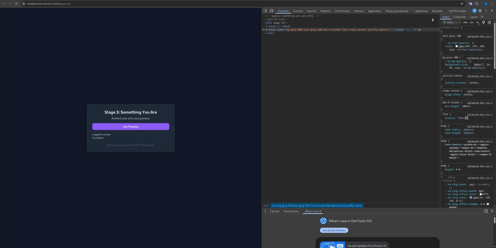
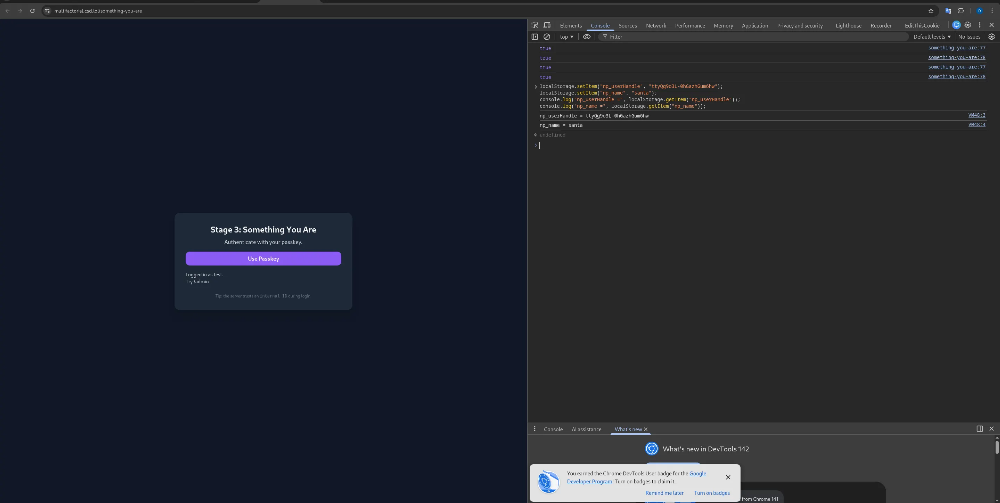
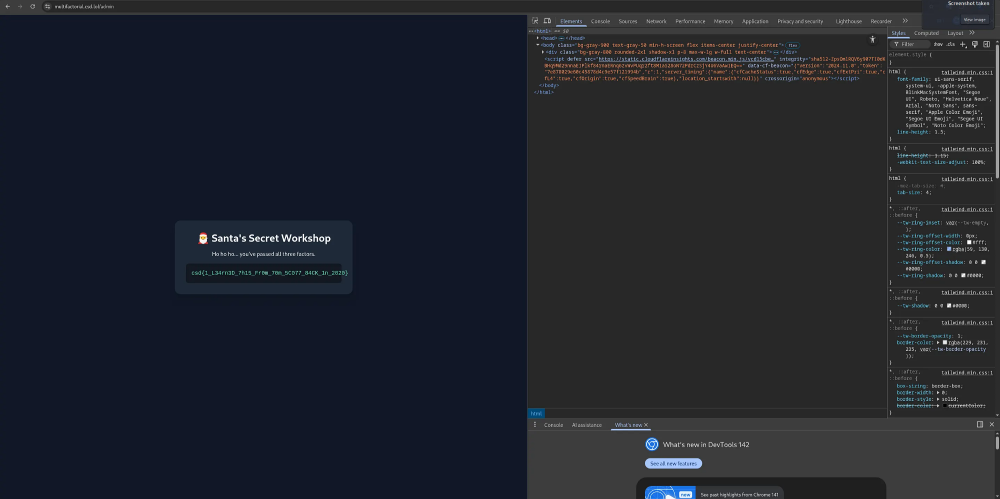

# day 14 Multifactorial

category : web exploit

## **Description**

Modern authentication relies on more than just a password.

Something you know, something you have, and something you are. Together, they're meant to provide layered security that can withstand compromise of any single factor.

Santa's workshop follows this model to the letter. A password gates access, a time-based code confirms possession, and a passkey verifies identity using modern cryptography. Each step appears independent. Each check appears correct.

Analyze the authentication flow end-to-end. If multifactor authentication is only as strong as its weakest link, can you find the point where identity becomes a matter of belief rather than proof?

[**https://multifactorial.csd.lol/**](https://multifactorial.csd.lol/)

---

***You are only allowed to test in the scope `https://multifactorial.csd.lol/*`.** Blind brute-force request sending (e.g. using tools like DirBuster) can trigger Cloudflare rate limits. Do not attempt to bypass Cloudflare limits. Therefore, if you wish to brute-force, please limit your wordlists or attack scope.*

hint 1

Stage 1: Look in the obfuscated JS code in the script tag. Do you notice anything among the strings? How are passwords commonly stored, and how can they be reversed?

Stage 2: Again, look in the code, do you see any values in a request that can modified? Perhaps, they reveal some [**useful information**](https://www.okta.com/identity-101/hmac/). Remember, a TOTP is usually six digits and often resets every 30 seconds (at :00 and :30 seconds).

Stage 3: The **`userHandle`** field in **`POST /api/webauthn/auth/verify`** may be in your interest. Does the server *really* verify that field? Try different names for the passkeys. How does the **`userHandle`** change? If something is always the same length, what could it be? Remember, your goal is to impersonate the **`santa`** user.

And for all the stages, remember that you can trivially determine what type of hash something is.

hint 2

Stage 1: There is a SHA-256 hash hidden in the script tag among the obfuscated code. Are you able to reverse it, perhaps by brute forcing? If you can't get it working locally, there are online tools to do this as well, like hashes.com.

Stage 2: **`HMAC = sha256(secret_key, message)`**. The **`message`** is just the six-digit TOTP code (and there are only 999,999 possibilities of that!).

Stage 3: If stage 1 has SHA-256, stage 2 has SHA-256, then stage 3 must... yep! Also have SHA-256! Also, SHA256 doesn't always output in hex. Try creating a userHandle yourself with **`santa`** instead of the passkey's name.

## Overview

This challenge simulates a modern Multi-Factor Authentication (MFA) system consisting of:

1. **Something You Know** → Password
2. **Something You Have** → TOTP (Time-based One-Time Password)
3. **Something You Are** → Passkey (WebAuthn)

# STAGE 1 Something You Know (Password)

Login using **username + password**

## Information Obtained

You obtained the following credentials:

```
bf33632dd9668787878890cb4fbb54261b6b7571:northpole123

```

Meaning:

- `bf33632dd9668787878890cb4fbb54261b6b7571` → **hash**
- `northpole123` → **plaintext password**

---

## Concept: Cracking the Hash

### What is a hash?

- Hash = one-way function
- Used to store passwords securely

### How can it be “cracked”?

Not reversing the hash, but:

- Trying common passwords
- Hashing those passwords
- Compare with the target hash

Example:

```
hash("northpole123") == bf33632dd9668787878890cb4fbb54261b6b7571

```

Valid password found.

Login successful → redirected to **Stage 2 (TOTP)**

# STAGE 2 Something You Have (TOTP)

### Purpose

Bypass **TOTP** verification without knowing the secret key.

---

## Initial Observations

Request to TOTP verification endpoint:

```bash
POST /api/something-you-have-verify?debug=1

```

Server response:

```json
{
"error":"Invalid TOTP code.",
"hmac":"20415574891d2dd8d79b5be5b2ad93b656bc38cd8a0c9ac71fc3cd1afcbf88cb",
"serverTime":1766093085
}

```

**Sensitive information leaked**:

- `serverTime`
- `hmac`

---

## Vulnerability Analysis

### How TOTP works (normally)

1. Server and client share a **secret**
2. TOTP is calculated from:

```
TOTP=Truncate(HMAC(secret,floor(time/30)))

```

### Design Error

- Server:
- Leaks `serverTime`
- Leaks `HMAC` output
- Secret is never effectively kept secret

---

## Exploitation

1. Use `serverTime` as the reference time
2. Reconstruct the HMAC-SHA256 algorithm
3. Brute-force the TOTP space (6 digits)
4. Search for code that produces the same HMAC

Automatic script generates:

```
[+] code: 322576

```

---

## Result

```json
{"success":true,"message":"TOTP correct. Proceed to passkey stage."}

```

Stage 2 successfully passed **without knowing the TOTP secret**.

---

# STAGE 3 Something You Are (Passkey / WebAuthn)

### Objective

Log in as **Santa (admin)** without having a Santa passkey.

---

## Step 1: Passkey Registration (Regular User)

### Action

- Access:

```
/register-passkey

```

- Registering a passkey as a regular user

### Server Output:

```
Credential ID: g2btPG_mj4erObRxqJ3iOQ
Internal ID (userHandle): n4bQgYhMfWWaL-qgxVrQFQ

```

---

## Technical Explanation

- **Credential ID** → Public key ID
- **userHandle** → Internal user ID (unsigned)
- Passkey:
- Private key stored in the OS
- Server only stores public key + metadata

---

## Client Storage

The frontend stores this data in `localStorage`:

```jsx
localStorage.setItem("np_userHandle", userHandle);
localStorage.setItem("np_credId", credId);

```

---

## Step 2: Manipulating localStorage

Because `localStorage` is **completely client-controlled**, an attacker can change its identity:

```jsx
localStorage.setItem("np_userHandle","ttyQg9o3L-0hGazhGum6hw");
localStorage.setItem("np_name","santa");

```

`ttyQg9o3L-0hGazhGum6hw` is **Santa's userHandle**.

---

## Step 3 Login Passkey

### Action

- Click **Use Passkey**
- Browser:
- Sign the challenge with **a regular user's private key**
- Send the payload:

```json
{
"id":"g2btPG_mj4erObRxqJ3iOQ",
"userHandle":"ttyQg9o3L-0hGazhGum6hw",
"signature":"VALID_SIGNATURE"
}

```

---

## Major Vulnerabilities

### Server fatal error:

- *Server trusts client's `userHandle`

Server only checks:

- Signature is valid → ✔
- UserHandle exists → ✔

Not checked:

- Does this credential **belong to this user**
- Does the userHandle match Public Key

## Impact

Attacker:

- Using their own passkey
- Claiming another user's identity
- Server accepting the claim

## Login Results

```
Logged in as santa.
Try /admin

```

## Flag

Accessing `/admin`:

```
csd{1_L34rn3D_7h15_Fr0m_70m_5C077_84CK_1n_2020}

```

---

# Root Cause Analysis

| Stage | Vulnerability |
| --- | --- |
| TOTP | Information leakage (serverTime + HMAC) |
| WebAuthn | Trusting client-supplied identity |
| MFA | Strong factor, weak implementation |

---

# Mitigation

### TOTP

- Don't leak HMAC / server time
- Use constant-time comparison

### WebAuthn

- **Ignore userHandle from client**
- Determine user based on credential ID
- Validate relationships:credential → user


northpole123








