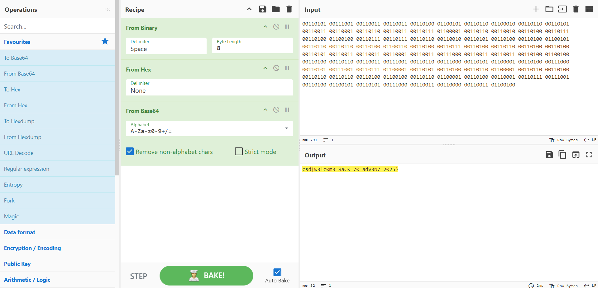

# day 1 The Mission Begins

category : cryptography

## **Description**

A series of repeated authentication failures was detected against the **FTP** service. The traffic pattern matched known Krampus Syndicate infrastructure, indicating the beginning of their intrusion attempts. After a sustained burst of password guessing, one request finally succeeded.

Your task is to examine the logs or packet capture, identify which account was **compromised**, and determine the password used during the successful login.

Submit your answer as: **`csd{username_password}`**

---

*Reminder: Answers are **case sensitive***

## **Attachments**

[**ftpchal.pcap**](https://files.vipin.xyz/api/public/dl/jBiEAP2X/Day%202/ftpchal.pcap)

csd{W3lc0m3_8aCK_70_adv3N7_2025}